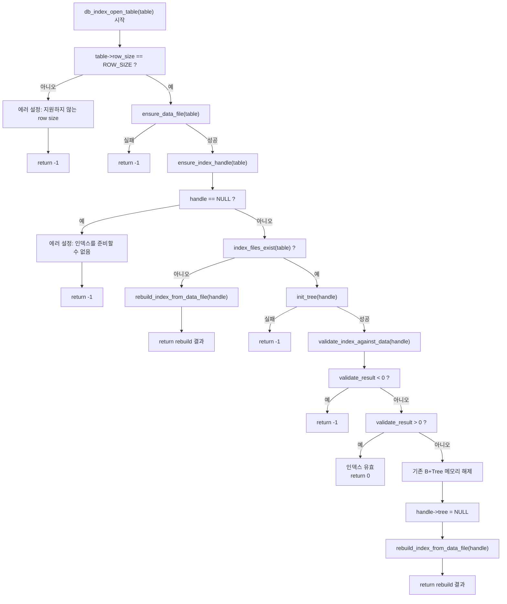

# Jungle Mini DB

## db_index_open_table 흐름도 

```mermaid
flowchart TD
    A["db_index_open_table(table) 시작"] --> B["table->row_size == ROW_SIZE ?"]

    B -- "아니오" --> B1["에러 설정: 지원하지 않는 row size"]
    B1 --> Z1["return -1"]

    B -- "예" --> C["ensure_data_file(table)"]
    C -- "실패" --> Z2["return -1"]
    C -- "성공" --> D["ensure_index_handle(table)"]

    D --> E["handle == NULL ?"]
    E -- "예" --> E1["에러 설정: 인덱스를 준비할 수 없음"]
    E1 --> Z3["return -1"]

    E -- "아니오" --> F["index_files_exist(table) ?"]

    F -- "아니오" --> F1["rebuild_index_from_data_file(handle)"]
    F1 --> Z4["return rebuild 결과"]

    F -- "예" --> G["init_tree(handle)"]
    G -- "실패" --> Z5["return -1"]
    G -- "성공" --> H["validate_index_against_data(handle)"]

    H --> I["validate_result < 0 ?"]
    I -- "예" --> Z6["return -1"]

    I -- "아니오" --> J["validate_result > 0 ?"]
    J -- "예" --> Z7["인덱스 유효<br/>return 0"]

    J -- "아니오" --> K["기존 B+Tree 메모리 해제"]
    K --> L["handle->tree = NULL"]
    L --> M["rebuild_index_from_data_file(handle)"]
    M --> Z8["return rebuild 결과"]

```
