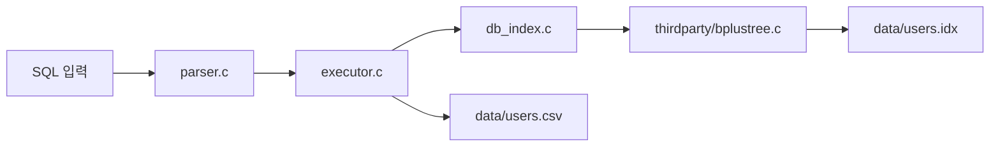
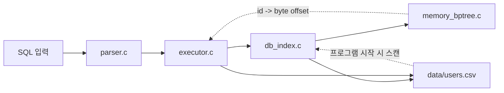
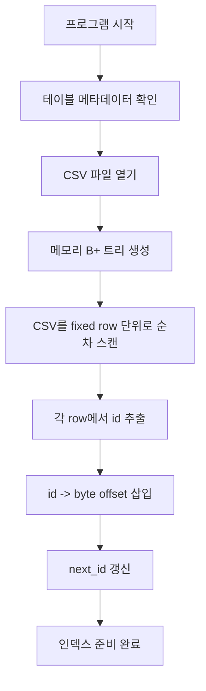
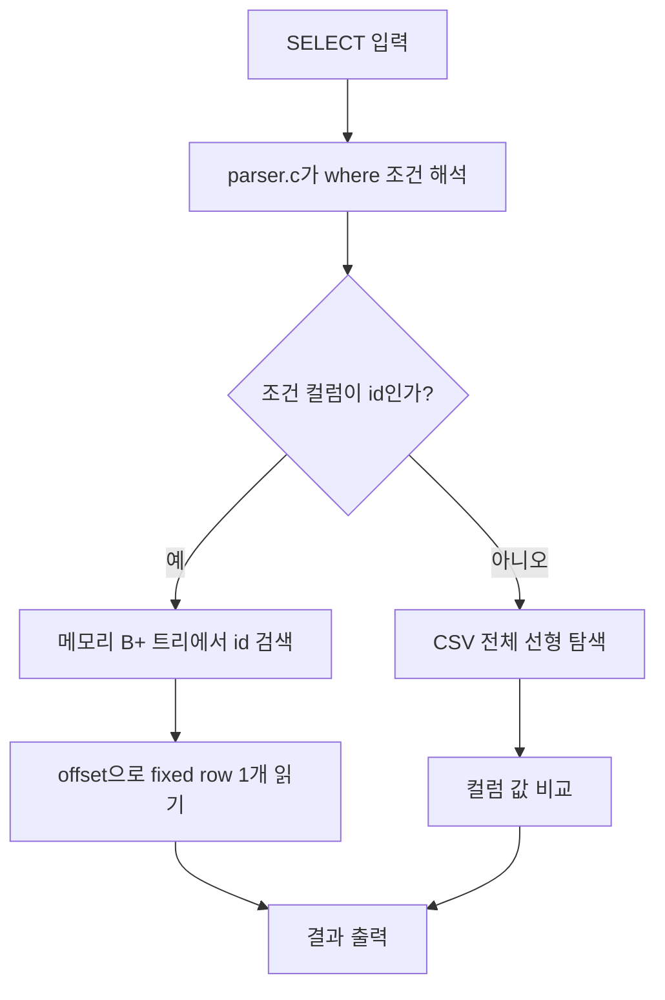
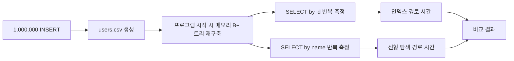
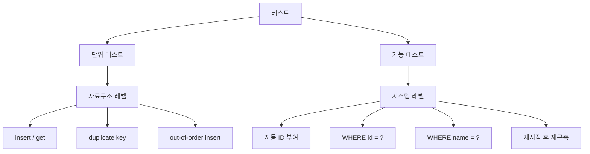
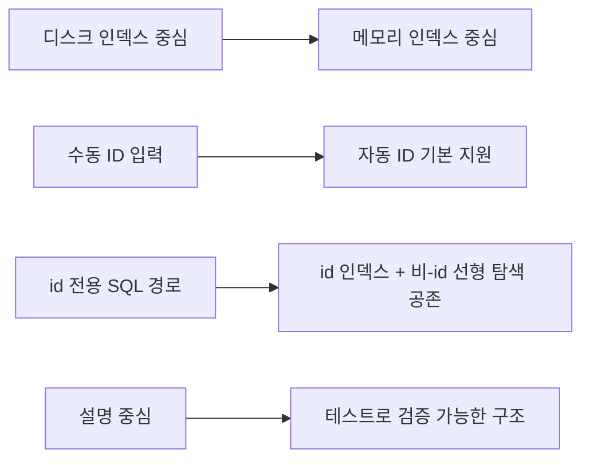

# reum-001 요구사항 정렬 후 큰 변경점

## 문서 목적

이 문서는 기존 구현과 현재 구현의 차이를 **표**, **흐름도**, **시퀀스 다이어그램** 중심으로 정리한 비교 문서다.

핵심 질문은 하나다.

> 무엇이 달라졌고, 그 변화가 요구사항과 어떻게 연결되는가?

## 1. 요약 비교표

| 비교 항목 | 이전 구현 | 현재 구현 | 왜 바꿨는가 |
| --- | --- | --- | --- |
| 인덱스 저장 위치 | `users.idx`, `posts.idx` 같은 디스크 파일 | 실행 중 메모리에만 존재하는 B+ 트리 | 과제 요구사항이 메모리 기반 방식에 더 가깝기 때문 |
| 인덱스 구현 방식 | 외부 `thirdparty/bplustree.c` 래핑 | 직접 구현한 `memory_bptree.c` 사용 | 핵심 로직을 코드 레벨에서 설명 가능하게 만들기 위해 |
| 프로그램 시작 시 동작 | 기존 인덱스 파일을 열고 검증 | CSV를 스캔해 메모리 인덱스를 재구축 | CSV를 기준 데이터로 두고 단순화하기 위해 |
| INSERT 입력 형식 | `insert into users values (104,name);` | `insert into users values (name);` 기본 지원 | 자동 ID 부여 요구사항 충족 |
| `WHERE id = ?` 처리 | 인덱스 조회 | 인덱스 조회 | 유지 |
| `WHERE name = ?` 처리 | 사실상 미지원 | SQL 실행기 안에서 선형 탐색 | 인덱스 조회와 선형 탐색 비교를 같은 시스템 안에서 보여주기 위해 |
| 성능 비교 방식 | id는 DB 경로, 비-id는 Python이 CSV 직접 스캔 | 둘 다 mini DB SQL 경로 사용 | 비교 조건을 공정하게 맞추기 위해 |
| 테스트 | 설명 위주 | 단위 테스트 + 기능 테스트 | 검증 가능한 결과물로 만들기 위해 |

## 2. 구조 비교 그림

### 그림 1. 이전 구조

이전 구조의 특징:

- 인덱스가 메모리 안에서만 유지되는 것이 아니라 별도 파일로 저장된다.
- 실행 중 흐름은 단순하지만, 과제 요구사항의 "메모리 기반"과는 거리가 있다.
- 비-id 조건 조회는 SQL 엔진 내부 경로로 자연스럽게 설명하기 어려웠다.

### 그림 2. 현재 구조

현재 구조의 특징:

- CSV는 실제 데이터 저장소다.
- 메모리 B+ 트리는 시작 시 CSV를 읽어 재구축된다.
- 실행 중 `id` 조회는 메모리 인덱스, 비-id 조회는 CSV 선형 탐색으로 분리된다.

## 3. 인덱스 라이프사이클 비교

### 표 2. 인덱스 수명 주기

| 단계 | 이전 구현 | 현재 구현 |
| --- | --- | --- |
| 프로그램 시작 | 인덱스 파일 존재 여부 확인 | CSV 파일 존재 여부 확인 |
| 초기화 | 인덱스 파일 열기 | 메모리 B+ 트리 생성 |
| 준비 과정 | 인덱스 파일 검증 또는 복구 | CSV 스캔 후 `id -> offset` 적재 |
| 실행 중 조회 | 디스크 인덱스 API 호출 | 메모리 B+ 트리 API 호출 |
| 프로그램 종료 | 인덱스 파일은 그대로 유지 | 메모리 인덱스 해제 |

### 그림 3. 현재 인덱스 준비 흐름

이 흐름 덕분에 현재 구현은 다음 성질을 가진다.

- CSV만 남아 있으면 언제든 인덱스를 다시 만들 수 있다.
- 인덱스 파일 손상 같은 별도 상태를 관리하지 않아도 된다.
- 메모리 기반 요구사항을 더 직접적으로 충족한다.

## 4. INSERT 처리 방식 비교

### 표 3. INSERT 입력 형식 변화

| 케이스 | 이전 구현 | 현재 구현 |
| --- | --- | --- |
| 자동 ID INSERT | 미지원 | `insert into users values (alice);` |
| 명시적 ID INSERT | `insert into users values (104,alice);` | 여전히 지원 |
| 기본 동작 | 사용자가 id를 직접 책임짐 | 시스템이 id를 계산해 부여 |

### 그림 4. 현재 자동 ID INSERT 시퀀스

```mermaid
sequenceDiagram
    participant U as User
    participant P as parser.c
    participant E as executor.c
    participant I as db_index.c
    participant T as memory_bptree.c
    participant F as users.csv

    U->>P: insert into users values (alice);
    P->>E: QUERY_INSERT(plan)
    E->>I: db_index_next_id("users")
    I-->>E: next_id = 1
    E->>F: fixed row append
    E->>I: db_index_put("users", 1, offset)
    I->>T: memory_bptree_put(1, offset)
    T-->>I: success
    I-->>E: success
```

### INSERT에서 달라진 핵심 포인트

| 포인트 | 설명 |
| --- | --- |
| ID 생성 책임 이동 | 사용자 입력에서 시스템 내부 책임으로 이동 |
| `next_id` 유지 | 가장 큰 id 다음 값을 인덱스 계층이 추적 |
| row 저장 순서 | ID 결정 후 fixed row 생성, CSV append, 인덱스 등록 |
| 호환성 | seed 데이터나 테스트 편의를 위해 명시적 ID 입력도 허용 |

## 5. SELECT 경로 분리

### 그림 5. 현재 SELECT 분기 흐름

### 표 4. 조회 경로 비교

| 조회 문장 | 사용 경로 | 비용 모델 |
| --- | --- | --- |
| `select * from users where id = 101;` | 메모리 B+ 트리 조회 후 단일 row 읽기 | 인덱스 탐색 + 1 row 접근 |
| `select * from users where name = alice;` | CSV 전체 선형 탐색 | row 수에 비례 |
| `select * from users;` | CSV 전체 순차 읽기 | row 수에 비례 |

### 예시로 보는 경로 차이

| 질의 | 내부 동작 요약 |
| --- | --- |
| `where id = 101` | `101 -> offset`을 인덱스에서 찾고 해당 위치만 읽는다 |
| `where name = alice` | 모든 row를 읽으면서 `name` 컬럼을 비교한다 |

## 6. 성능 비교 방식의 차이

### 표 5. 벤치마크 관점 비교

| 비교 항목 | 이전 구현 | 현재 구현 |
| --- | --- | --- |
| id 조회 측정 | mini DB SQL 경로 | mini DB SQL 경로 |
| 비-id 조회 측정 | Python이 CSV 직접 스캔 | mini DB SQL 경로 |
| 비교 공정성 | 실행 경로가 서로 다름 | 실행 경로가 동일한 계층 안에 있음 |
| 설명 가능성 | "외부 스크립트가 대신 측정" 느낌 | "DB 내부 경로 두 개를 비교"라고 설명 가능 |

### 그림 6. 현재 벤치마크 개념도

## 7. 테스트 구조 비교

### 표 6. 테스트 계층

| 테스트 종류 | 파일 | 검증 대상 |
| --- | --- | --- |
| 단위 테스트 | `tests/test_memory_bptree.c` | B+ 트리 insert/get, 중복 키, 순서 섞인 입력 |
| 기능 테스트 | `tests/test_mini_db_requirements.py` | 자동 ID 부여, `where id`, `where name`, 재시작 후 재구축 |

### 그림 7. 테스트 범위 지도

## 8. 파일 책임 분해표

| 파일 | 현재 역할 | 이전 구현과의 차이 |
| --- | --- | --- |
| `memory_bptree.c` | 메모리 기반 B+ 트리 구현 | 새로 추가됨 |
| `memory_bptree.h` | B+ 트리 외부 인터페이스 | 새로 추가됨 |
| `db_index.c` | CSV 스캔, `next_id`, `id -> offset` 관리 | 디스크 인덱스 wrapper에서 메모리 인덱스 관리자로 역할 변경 |
| `parser.c` | `where id = ?`, `where name = ?`, 자동 ID INSERT 파싱 | id 전용 파서에서 일반 컬럼 조건 일부 지원으로 확장 |
| `executor.c` | id 인덱스 조회와 비-id 선형 탐색 분기 | 조회 경로가 더 명확히 분리됨 |
| `scripts/benchmark_bplus_tree_index.py` | SQL 경로 기준 성능 비교 | 외부 CSV 직접 스캔 로직 제거 |

## 9. 요약 그림

### 그림 8. 변화의 방향

## 10. 최종 정리

### 표 7. 이 문서의 핵심만 다시 압축

| 질문 | 답 |
| --- | --- |
| 가장 큰 구조 변화는? | 디스크 인덱스에서 메모리 B+ 트리 재구축 방식으로 바뀌었다 |
| 가장 큰 기능 변화는? | INSERT 시 자동 ID를 부여하고, 비-id `WHERE`를 선형 탐색으로 처리한다 |
| 가장 큰 검증 변화는? | 단위 테스트와 기능 테스트를 분리해 추가했다 |
| 가장 큰 의미는? | 구현 방식이 요구사항의 언어와 더 가까워졌다 |

결국 이번 변경은 단순한 코드 교체가 아니라, 시스템의 관점을 바꾼 것이다.

- 인덱스는 파일이 아니라 실행 중 자료구조가 되었고
- INSERT는 입력이 아니라 시스템 정책이 되었고
- 성능 비교는 외부 스크립트가 아니라 SQL 실행 경로 비교가 되었고
- 검증은 설명이 아니라 테스트로 남게 되었다

이 문서는 그 차이를 글보다 **표와 그림으로 먼저 이해할 수 있도록** 정리한 비교본이다.
