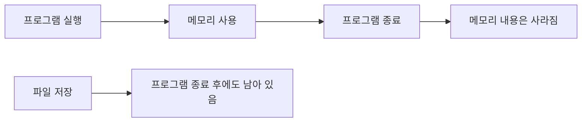
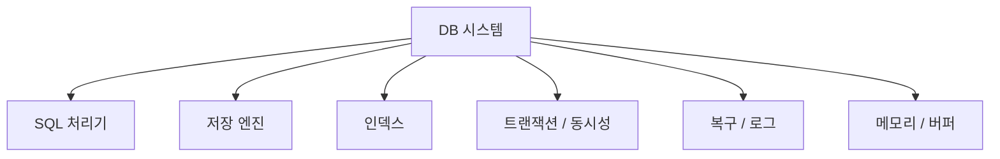
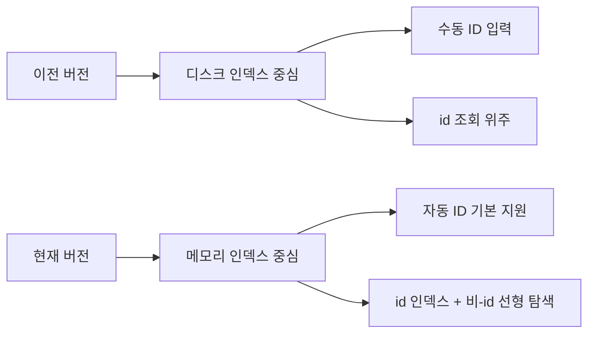
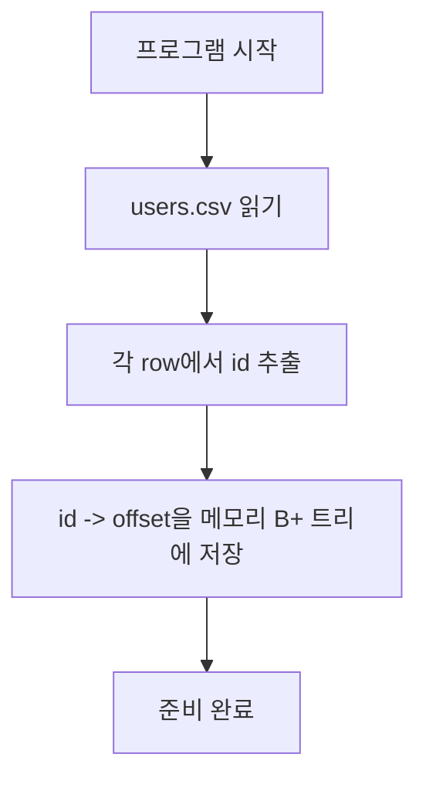
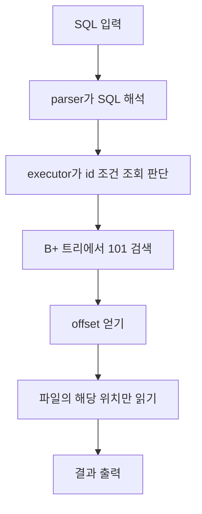
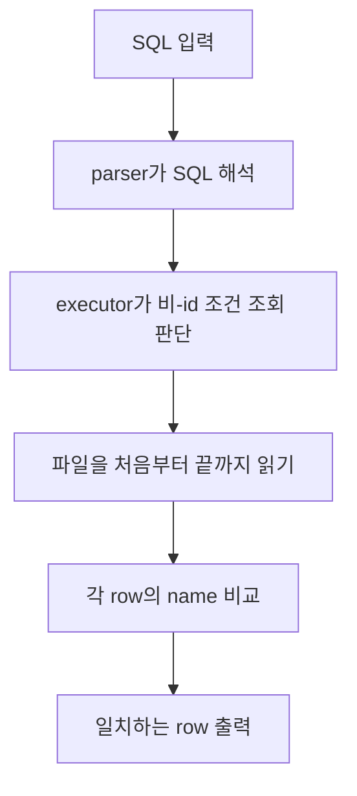

# reum-002 미니 DB와 SQL 처리기를 이해하기 위한 기초 배경지식

## 이 문서는 누구를 위한 문서인가

이 문서는 컴퓨터공학과에 막 입학한 학생이 다음 질문들에 답할 수 있도록 만든 **입문용 배경지식 문서**다.

- 데이터베이스(DB)는 왜 필요한가
- SQL은 무엇이고, SQL 처리기는 무슨 일을 하는가
- DB 프로그램은 보통 어떤 부품들로 이루어지는가
- B-트리와 B+ 트리는 왜 DB에서 자주 등장하는가
- 이 프로젝트의 두 가지 버전은 무엇이 어떻게 다른가

`reum-001`이 "기존 구현과 현재 구현이 무엇이 다른가"를 설명하는 문서라면,
이 문서는 그 문서를 읽기 전에 알아두면 좋은 **기초 개념 모음집**이다.

## 이 문서 다음에 읽을 확장 문서

이 문서는 "입문용 배경지식"에 집중한다.
설계 단계에서 GPT와 나눈 대화 내용을 주제별로 재구성한 확장 문서는 아래 순서로 읽으면 된다.

| 문서 | 역할 |
| --- | --- |
| `reum-003` | 대화 export 기반 문서 묶음 안내와 커버리지 지도 |
| `reum-004` | MVP 범위, 구현 순서, 테스트/성능/README 계획 |
| `reum-005` | 설계 선택지, 의사결정 기준, 추천 조합 |
| `reum-006` | locator, row index, offset, 저장 형식, 주소 개념 |
| `reum-007` | 메모리 기반 구현 흐름과 인덱스 사용 방식 |

---

## 0. 어떻게 읽으면 좋은가

### 추천 읽기 순서

| 순서 | 섹션 | 왜 먼저 읽나 |
| --- | --- | --- |
| 1 | DB와 컴퓨터의 기본 개념 | 가장 기초 단어를 먼저 익혀야 뒤가 편하다 |
| 2 | DB의 역사와 큰 흐름 | 왜 지금 같은 구조가 되었는지 감이 잡힌다 |
| 3 | SQL 처리기와 DB 컴포넌트 | 프로그램이 여러 조각으로 나뉘는 이유를 이해한다 |
| 4 | SQL 처리기를 만드는 여러 방식 | 설계 선택지가 여러 개라는 감각을 얻는다 |
| 5 | B-트리와 B+ 트리 | 인덱스가 왜 필요한지 이해한다 |
| 6 | 이 프로젝트의 두 버전 | 앞의 개념들을 실제 코드와 연결한다 |

### 이 문서에서 가장 중요한 한 줄

> 데이터베이스는 "데이터를 저장하는 곳"일 뿐만 아니라, "그 데이터를 빨리 찾고, 안전하게 바꾸고, 쉽게 질의하게 만드는 시스템"이다.

---

## 1. 정말 기본부터: DB를 이해하기 위한 최소 단어

### 표 1. 가장 기초적인 용어

| 단어 | 쉬운 뜻 | 예시 |
| --- | --- | --- |
| 데이터 | 저장하고 싶은 정보 | 이름, 나이, 게시글 |
| 프로그램 | 명령을 받아 동작하는 코드 묶음 | `jungle_mini_db` |
| 파일 | 디스크에 저장되는 데이터 묶음 | `data/users.csv` |
| 메모리 | 프로그램이 실행되는 동안만 쓰는 작업 공간 | 실행 중 만들어지는 인덱스 |
| 데이터베이스(DB) | 데이터를 저장하고 관리하는 체계 | MySQL, PostgreSQL, SQLite, 이 프로젝트 |
| 테이블 | 같은 종류의 데이터를 표처럼 모아둔 것 | `users` |
| 행(row) | 테이블의 한 줄 데이터 | `101,project-user` |
| 열(column) | 각 데이터 항목의 종류 | `id`, `name` |
| 쿼리(query) | DB에게 보내는 요청 | `select * from users;` |
| SQL | 쿼리를 쓰는 대표 언어 | `select`, `insert`, `update` |
| 인덱스 | 데이터를 빨리 찾기 위한 보조 구조 | `id -> 위치` |
| 처리기(processor) | 입력을 해석하고 실행하는 부분 | SQL 처리기 |

이 표의 단어를 편하게 읽을 수 있으면, 이후 내용이 훨씬 쉬워진다.

### 신입생용 읽기 팁: 단어를 따로 외우지 말고 흐름으로 묶어 보자

처음 DB를 배우면 용어가 너무 많아서 겁이 날 수 있다.
그런데 실제로는 아래 흐름 하나로 꽤 많이 정리된다.

1. 데이터가 있다
2. 그 데이터를 파일이나 메모리에 저장한다
3. 테이블은 같은 종류의 데이터를 정리해서 담는다
4. SQL은 그 데이터를 보여 달라고 요청하는 언어다
5. SQL 처리기는 그 요청을 해석해서 실행한다
6. 인덱스는 그 과정에서 빨리 찾게 도와주는 구조다

즉, 용어를 하나씩 외우는 것보다
"데이터를 저장하고, 요청하고, 찾고, 반환하는 흐름"
안에서 각 단어를 보는 편이 훨씬 쉽다.

---

## 2. 데이터베이스는 왜 필요한가

우리는 프로그램을 만들 때 보통 데이터를 저장해야 한다.

예를 들어 사용자 목록이 있다고 해보자.

| id | name |
| --- | --- |
| 101 | project-user |
| 102 | second-project-user |
| 103 | no-header-user |

이 정보를 그냥 변수 몇 개에만 담아두면 프로그램이 종료될 때 사라진다.
그래서 보통은 파일이나 데이터베이스에 저장한다.

### 표 2. 그냥 파일과 DB의 차이

| 구분 | 그냥 파일만 쓰는 경우 | DB를 쓰는 경우 |
| --- | --- | --- |
| 저장 | 가능 | 가능 |
| 검색 | 직접 코드를 짜야 함 | DB가 도와줌 |
| 정렬/필터링 | 직접 구현해야 함 | SQL로 요청 가능 |
| 동시성/안전성 | 직접 챙겨야 함 | 많은 DB가 기본 기능 제공 |
| 대용량 처리 | 점점 복잡해짐 | 전문 기능이 많음 |

즉, 데이터베이스는 단순히 "저장소"가 아니라

- 저장하고
- 찾고
- 바꾸고
- 정리하고
- 안전하게 관리하는

시스템이라고 생각하면 된다.

---

## 3. 파일과 메모리는 무엇이 다른가

이 차이를 이해하는 것이 중요하다.

### 표 3. 파일 vs 메모리

| 구분 | 파일 | 메모리 |
| --- | --- | --- |
| 어디에 있나 | 디스크에 있음 | 실행 중인 프로그램 안에 있음 |
| 얼마나 오래 남나 | 프로그램이 꺼져도 남음 | 프로그램이 종료되면 사라짐 |
| 속도 | 메모리보다 느릴 수 있음 | 보통 빠름 |
| 목적 | 오래 보관 | 빠르게 작업 |

### 그림 1. 파일과 메모리의 관계



DB는 보통:

- 실제 데이터는 파일에 저장하고
- 실행 중 필요한 구조는 메모리에 올려서

둘을 함께 사용한다.

---

## 4. 테이블, 행, 열, 스키마

데이터베이스에서는 데이터를 표처럼 생각한다.

| id | name |
| --- | --- |
| 1 | alice |
| 2 | bob |
| 3 | carol |

여기서

- `id`, `name`은 **열(column)**
- `1, alice`는 **행(row)**
- 전체 표는 **테이블(table)**

이다.

### 스키마(schema)란?

스키마는 "이 테이블이 어떤 모양인지에 대한 약속"이다.

예를 들어:

```text
users 테이블은 id(int), name(text) 두 컬럼을 가진다
```

같은 설명이 스키마다.

### 표 4. 스키마에 들어가는 대표 정보

| 항목 | 예시 |
| --- | --- |
| 테이블 이름 | `users` |
| 컬럼 이름 | `id`, `name` |
| 타입 | 정수, 문자열 |
| 제약조건 | 중복 금지, null 금지 |

---

## 5. SQL은 무엇인가

SQL은 데이터베이스에게 내리는 명령문이다.

대표적으로는:

| SQL | 뜻 |
| --- | --- |
| `select * from users;` | users의 모든 줄을 보여줘 |
| `select * from users where id = 101;` | id가 101인 줄을 찾아줘 |
| `insert into users values (alice);` | 새 데이터를 추가해줘 |
| `update users set name = bob where id = 1;` | 기존 데이터를 바꿔줘 |
| `delete from users where id = 1;` | 데이터를 지워줘 |

즉, SQL은 사람이 읽기 쉬운 데이터 요청 언어다.

### SQL 문장을 읽는 기본 요령

SQL이 처음에는 길고 복잡해 보여도,
사실은 아래 순서로 끊어 읽으면 꽤 단순하다.

| 키워드 | 쉬운 뜻 |
| --- | --- |
| `select` | 무엇을 보여줄까 |
| `from` | 어디 테이블에서 가져올까 |
| `where` | 어떤 조건에 맞는 것만 가져올까 |
| `insert into` | 어디에 새 데이터를 넣을까 |
| `values` | 어떤 값을 넣을까 |

예를 들어

```sql
select * from users where id = 101;
```

이 문장은 아래처럼 읽으면 된다.

1. `select *`: 전부 보여줘
2. `from users`: `users` 테이블에서
3. `where id = 101`: 단, `id`가 101인 것만

이 읽기 습관은 나중에 parser를 이해할 때도 그대로 도움이 된다.
parser는 결국 이 문장을 기계가 읽기 쉬운 조각으로 나누는 부품이기 때문이다.

---

## 6. `id`, key, primary key는 왜 중요한가

초보자에게 자주 헷갈리는 부분은 `id`, `key`, `primary key`가 무엇인지다.

### 표 5. 비슷하지만 다른 단어

| 단어 | 쉬운 뜻 |
| --- | --- |
| `id` | 각 데이터를 구별하기 위한 번호로 자주 쓰는 컬럼 |
| key | 검색/구분 기준이 되는 값 |
| primary key | 한 행을 대표하는 가장 중요한 고유 key |

예를 들어:

| id | name |
| --- | --- |
| 1 | kim |
| 2 | kim |

`name`은 같을 수 있지만 `id`는 다르게 둘 수 있다.
그래서 `id`는 자주 primary key 역할을 한다.

---

## 7. offset은 무엇인가

`offset`은 파일 안에서 몇 번째 바이트부터 읽을지를 나타내는 숫자다.

쉽게 말하면 "파일 안의 주소" 같은 것이다.

예를 들어 각 행이 64바이트라면:

| 행 번호 | 시작 위치(offset) |
| --- | --- |
| 1번째 행 | 0 |
| 2번째 행 | 64 |
| 3번째 행 | 128 |

### 그림 2. offset 개념

```text
파일 시작
|---- 64 bytes ----|---- 64 bytes ----|---- 64 bytes ----|
0                 64                 128                192
^                  ^                  ^
row 1 시작          row 2 시작          row 3 시작
```

그래서 인덱스는 보통 이렇게 저장될 수 있다.

```text
101 -> 0
102 -> 64
103 -> 128
```

즉, `id`를 보고 파일 안에서 어디를 읽어야 할지 바로 알 수 있다.

---

## 8. 데이터베이스의 역사 아주 짧게 보기

역사를 꼭 외울 필요는 없지만, 흐름을 알면 왜 지금의 DB가 이런 모양인지 이해하기 쉽다.

### 표 6. DB 역사 한눈에 보기

| 시기 | 큰 흐름 | 왜 중요했나 |
| --- | --- | --- |
| 초기 컴퓨팅 시기 | 파일 중심 데이터 관리 | 가장 단순한 저장 방식 |
| 1960년대 | 계층형 DB, 네트워크형 DB | 구조화된 데이터 관리 시도 |
| 1970년대 | 관계형 DB 이론 등장 | 표와 SQL 중심 사고의 시작 |
| 1980년대 | 상용 RDBMS 확산 | Oracle, DB2, SQL Server 같은 제품들이 성장 |
| 1990년대 | 대형 기업 시스템에서 관계형 DB가 표준처럼 사용 | 업무 시스템의 중심이 됨 |
| 2000년대 이후 | NoSQL, 분산 시스템, 클라우드 DB 확산 | 웹 규모 데이터와 유연성이 중요해짐 |
| 최근 | 클라우드 DB, NewSQL, 분석 DB, 벡터 DB 등 다양화 | 용도별 DB가 세분화됨 |

### 중요한 역사 포인트

1. 처음에는 그냥 파일로 데이터를 관리했다.
2. 데이터가 커지고 복잡해지자 구조화된 DB가 필요해졌다.
3. 관계형 모델과 SQL이 큰 표준이 되었다.
4. 이후에는 웹 서비스, 대규모 분산 환경, AI 등 새로운 요구 때문에 다양한 DB가 다시 등장했다.

---

## 9. 관계형 DB란 무엇인가

관계형 DB(Relational Database)는 데이터를 **표(table)** 중심으로 다루는 DB다.

오늘날 가장 널리 알려진 DB들 중 다수가 관계형 DB다.

예:

- PostgreSQL
- MySQL
- SQLite
- Oracle
- SQL Server

### 관계형 DB가 사랑받은 이유

| 이유 | 설명 |
| --- | --- |
| 표 형태가 직관적 | 사람이 이해하기 쉬움 |
| SQL 사용 가능 | 조회와 조작이 편함 |
| 제약조건 설정 가능 | 데이터 품질 관리에 유리 |
| 조인(join) 가능 | 여러 테이블을 연결해서 조회 가능 |

---

## 10. DB를 만들 때 알아두면 좋은 기본 개념들

이 프로젝트에 모두 들어가지는 않지만, DB를 만들려면 자주 만나는 개념들이다.

### 표 7. DB 기본 개념

| 개념 | 쉬운 설명 | 왜 중요한가 |
| --- | --- | --- |
| 저장(storage) | 데이터를 파일에 쓰고 읽는 방법 | DB의 가장 바닥 |
| 인덱스(index) | 데이터를 빨리 찾는 보조 구조 | 검색 속도 향상 |
| 트랜잭션(transaction) | 여러 작업을 하나의 묶음처럼 처리 | 중간 실패 시 안정성 |
| 동시성(concurrency) | 여러 사용자가 동시에 접근하는 문제 | 충돌 방지 |
| 복구(recovery) | 장애 이후 상태를 되살리는 기능 | 데이터 보호 |
| 버퍼 관리(buffer manager) | 디스크 데이터 일부를 메모리에 캐싱 | 성능 향상 |
| 쿼리 최적화(optimizer) | 같은 SQL을 더 효율적인 실행 방법으로 바꿈 | 속도 향상 |

### 트랜잭션을 아주 쉽게 설명하면

예를 들어 은행 송금은 사실 두 단계다.

1. A 계좌에서 돈 빼기
2. B 계좌에 돈 넣기

그런데 1번만 성공하고 2번이 실패하면 큰일 난다.
그래서 두 작업을 하나처럼 묶어서 처리하는 개념이 트랜잭션이다.

### ACID란?

트랜잭션을 설명할 때 자주 나오는 네 글자다.

| 글자 | 뜻 | 쉬운 설명 |
| --- | --- | --- |
| A | Atomicity | 전부 성공하거나 전부 실패해야 함 |
| C | Consistency | 규칙이 깨지지 않아야 함 |
| I | Isolation | 동시에 실행돼도 서로 꼬이지 않아야 함 |
| D | Durability | 성공한 결과는 장애 후에도 남아야 함 |

이 프로젝트는 아주 작은 DB라서 ACID 전체를 깊게 구현하지 않지만, 실제 DB 세계에서는 매우 중요하다.

---

## 11. SQL 처리기란 무엇인가

SQL 처리기는 사용자가 입력한 SQL을 읽고, 그 뜻을 이해하고, 실제 동작으로 바꾸는 부분이다.

쉽게 말하면:

> SQL 처리기는 "사람이 쓴 SQL 문장"을 "컴퓨터가 실행할 단계"로 바꾸는 통역가 + 지휘자다.

예를 들어:

```sql
select * from users where id = 101;
```

이 문장을 처리기는 보통 다음처럼 다룬다.

1. 글자를 읽는다
2. 문법이 맞는지 본다
3. `users` 테이블, `id` 조건이라는 의미를 해석한다
4. 어떤 방식으로 찾을지 결정한다
5. 실제 데이터를 읽고 결과를 출력한다

---

## 12. SQL 처리기의 주요 부품

### 그림 3. 전형적인 SQL 처리 흐름


### 표 8. 각 단계가 하는 일

| 단계 | 하는 일 | 쉬운 비유 |
| --- | --- | --- |
| 토큰화 | 글자를 의미 있는 조각으로 나눔 | 문장을 단어로 끊기 |
| 파싱 | 문법이 맞는지 확인하고 구조를 만듦 | 문장 구조 분석 |
| 의미 해석 | 어떤 테이블/컬럼인지 확인 | 단어 뜻 확인 |
| 플랜 생성 | 어떻게 실행할지 큰 계획을 잡음 | 요리 순서 정하기 |
| 최적화 | 더 빠른 방법이 있는지 고름 | 최단 경로 찾기 |
| 실행 | 실제로 데이터를 읽고 씀 | 실제 작업 수행 |

### 아주 작은 end-to-end 예시: SQL 한 줄은 어디를 지나가나

다음 SQL이 들어왔다고 해보자.

```sql
select * from users where id = 101;
```

이 한 줄은 머릿속에서 대략 이렇게 지나간다.

1. 사용자가 SQL 문자열을 입력한다
2. parser가 `select`, `users`, `id = 101` 같은 조각으로 나눈다
3. parser는 "이건 `users` 테이블에서 `id` 조건으로 찾는 조회"라고 정리한다
4. executor가 그 정리된 결과를 받아 "id 조건이면 인덱스를 쓰자"라고 판단한다
5. 인덱스가 `101`에 대응하는 위치를 알려준다
6. storage가 그 위치의 실제 row를 읽는다
7. 결과를 화면에 출력한다

즉, SQL 처리기는
"문자열을 읽는 부분"과
"실제 작업을 수행하는 부분"으로 나뉜다고 이해하면 된다.

### 이 프로젝트와 연결하면

| 일반적인 이름 | 이 프로젝트에서 비슷한 역할 |
| --- | --- |
| Parser | `parser.c` |
| Executor | `executor.c` |
| Storage | CSV 파일 접근 로직 |
| Index manager | `db_index.c` |
| Index structure | `memory_bptree.c` |

---

## 13. DB 프로그램의 큰 컴포넌트들

SQL 처리기만 있는 것이 아니라, DB 전체는 보통 더 큰 구조를 가진다.

### 그림 4. DB의 대표 컴포넌트 지도



### 표 9. 컴포넌트별 역할

| 컴포넌트 | 역할 |
| --- | --- |
| SQL 처리기 | 사용자의 SQL을 읽고 실행 계획을 만듦 |
| 저장 엔진 | 파일에 실제 데이터를 쓰고 읽음 |
| 인덱스 | 빠른 검색을 지원 |
| 트랜잭션 계층 | 여러 작업을 안정적으로 묶음 |
| 복구 계층 | 장애 후 데이터를 복원 |
| 메모리/버퍼 계층 | 디스크 접근을 줄이고 성능을 높임 |

작은 DB 실습 프로젝트는 이 중 일부만 구현하는 경우가 많다.

---

## 14. SQL 처리기의 역사 아주 짧게 보기

SQL 처리기가 지금처럼 여러 단계로 나뉜 이유도 역사와 관련이 있다.

### 표 10. SQL 처리기의 큰 발전 흐름

| 시기 | 특징 |
| --- | --- |
| 초기 | 단순한 질의만 지원, 기능이 적음 |
| 관계형 DB 확산기 | SQL 파서, 실행기, 옵티마이저 구조가 자라남 |
| 상용 DB 성장기 | 비용 기반 최적화, 동시성, 복구가 고도화 |
| 현대 | 분산 실행, 컬럼 저장, 스트리밍, 클라우드 환경까지 확장 |

처음에는 단순히 "문장을 읽고 처리"하는 수준이었다면,
이제는 "여러 테이블, 여러 인덱스, 여러 사용자, 분산 환경"까지 고려해야 하므로 구조가 더 복잡해졌다.

---

## 15. SQL 처리기를 만드는 여러 방식

여기서부터는 "같은 SQL 처리기라도 여러 방식으로 만들 수 있다"는 점을 배우는 섹션이다.

### 15.1 가장 단순한 방식: 문자열을 직접 비교하는 방식

예:

```text
if 입력이 "select"로 시작하면 ...
if 입력이 "insert"로 시작하면 ...
```

#### 장점

- 구현이 쉽다
- 작은 프로젝트에 빠르게 적용 가능하다

#### 단점

- SQL 문법이 조금만 복잡해져도 코드가 지저분해진다
- 유지보수가 어렵다

#### 어디에 쓰기 좋은가

- 학습용
- 아주 작은 미니 DB
- 제한된 SQL만 지원하는 프로젝트

---

### 15.2 손으로 직접 파서를 짜는 방식

대표적으로 **재귀 하강 파서(recursive descent parser)** 같은 방식이 있다.

이 방식은 문법 규칙을 함수들로 직접 풀어쓴다.

#### 장점

- 동작을 직접 제어할 수 있다
- 배우기 좋다
- 작은 언어에는 잘 맞는다

#### 단점

- 문법이 커질수록 손이 많이 간다
- 실수할 여지가 있다

#### 어디에 쓰기 좋은가

- 교육용 컴파일러/인터프리터
- 소규모 DSL
- 작은 SQL subset 구현

---

### 15.3 파서 생성기(parser generator)를 쓰는 방식

예:

- Yacc/Bison
- ANTLR
- JavaCC

문법을 선언적으로 적으면, 파서 코드를 자동으로 생성해준다.

#### 장점

- 복잡한 문법을 다루기 좋다
- 문법 관리가 체계적이다

#### 단점

- 처음 배우기 어렵다
- 생성된 코드를 이해하기 어려울 수 있다

#### 어디에 쓰기 좋은가

- 언어 처리기
- 복잡한 SQL 문법 지원
- 대형 프로젝트

---

### 15.4 AST를 만들고 해석하는 방식

AST(Abstract Syntax Tree)는 "문장을 트리 구조로 표현한 것"이다.

예를 들어 SQL을 읽으면 내부적으로 이런 생각을 할 수 있다.

```text
SELECT
├── table: users
└── where
    ├── column: id
    └── value: 101
```

이 트리를 만든 뒤, 실행기가 이 트리를 따라가며 동작한다.

#### 장점

- 구조가 명확하다
- 나중에 최적화나 변환을 넣기 쉽다

#### 단점

- 단순한 프로젝트에는 조금 무겁게 느껴질 수 있다

#### 어디에 쓰기 좋은가

- 일반적인 쿼리 처리기
- 언어 해석기
- 최적화가 필요한 시스템

---

### 15.5 바로 실행하는 방식 vs 실행 계획을 만드는 방식

### 표 11. 두 가지 큰 실행 스타일

| 방식 | 설명 | 장점 | 단점 | 자주 쓰이는 곳 |
| --- | --- | --- | --- | --- |
| Direct execution | 파싱 후 바로 if/else로 실행 | 단순함 | 확장성이 약함 | 작은 프로젝트 |
| Plan-based execution | 먼저 실행 계획(plan)을 만들고, 그 계획을 실행 | 구조가 깔끔함 | 초반 설계가 더 필요 | 실제 DB, 확장형 프로젝트 |

이 프로젝트는 작은 규모이지만, `plan`이라는 중간 구조를 사용해 plan-based에 조금 가까운 형태를 가진다.

---

### 15.6 인터프리터 방식 vs 바이트코드/가상머신 방식

### 표 12. 더 발전된 실행 방식

| 방식 | 설명 | 장점 | 단점 |
| --- | --- | --- | --- |
| 인터프리터 방식 | 실행할 때 구조를 직접 읽으며 처리 | 구현이 직관적 | 반복 실행에서 비효율 가능 |
| 바이트코드/VM 방식 | 중간 명령어로 바꿔 실행 | 최적화와 재사용에 유리 | 구현 난이도 상승 |

예를 들어 SQLite는 내부적으로 바이트코드 비슷한 구조를 사용한다.

---

### 15.7 규칙 기반 최적화 vs 비용 기반 최적화

SQL 처리기가 복잡해지면 "어떻게 실행할지"를 고르는 과정이 중요해진다.

### 표 13. 최적화 두 방식

| 방식 | 설명 | 장점 | 단점 |
| --- | --- | --- | --- |
| 규칙 기반 | 미리 정해둔 규칙으로 실행 방법 선택 | 구현이 쉽다 | 상황별 최적 선택이 약할 수 있다 |
| 비용 기반 | 데이터 양, 인덱스, 통계 등을 보고 더 싼 계획 선택 | 실제 성능에 유리 | 구현이 어렵다 |

작은 DB 실습은 보통 규칙 기반이나 "최적화 거의 없음"으로 시작한다.

---

## 16. SQL 처리기를 어떤 방식으로 만들면 좋은가

정답은 없고, 목적에 따라 다르다.

### 표 14. 목적별 추천 접근

| 목표 | 추천 방식 |
| --- | --- |
| SQL 처리기 개념 공부 | 손으로 직접 파서 + 단순 실행기 |
| 언어 처리기 공부 | 재귀 하강 파서 또는 파서 생성기 |
| 실제 제품 수준 구조 맛보기 | AST + plan + executor 구조 |
| 매우 빠른 프로토타입 | 문자열 비교 + 제한된 SQL subset |
| 복잡한 SQL 지원 | 파서 생성기 + planner + optimizer |

초보자 프로젝트에서는 보통:

1. 직접 파서 짜기
2. 간단한 plan 만들기
3. executor 분리하기
4. storage/index 붙이기

순서가 학습하기 좋다.

---

## 17. B-트리를 이해하기 위한 별도 섹션

이 섹션은 B-트리 계열을 따로 떼어 설명한다.

### 17.1 왜 트리가 필요한가

숫자를 찾을 때 매번 처음부터 끝까지 보면 느리다.
그래서 "범위를 줄이면서 찾는 구조"가 필요하다.

트리는 그 범위를 줄이는 데 도움을 준다.

---

### 17.2 이진 탐색과 이진 탐색 트리

배열이 정렬되어 있으면 **이진 탐색(binary search)** 으로 빠르게 찾을 수 있다.

트리 버전으로 생각하면 **이진 탐색 트리(BST)** 를 떠올릴 수 있다.

하지만 BST는 삽입 순서가 안 좋으면 한쪽으로 기울 수 있다.

예:

```text
1
 \
  2
   \
    3
     \
      4
```

이렇게 되면 거의 선형 탐색처럼 느려질 수 있다.

---

### 17.3 B-트리는 무엇인가

B-트리는 한 노드가 여러 개의 key를 가질 수 있는 트리다.

즉, 일반적인 "왼쪽/오른쪽" 두 갈래만 있는 구조보다 더 넓게 퍼지는 트리다.

### 표 15. B-트리의 핵심 특징

| 특징 | 뜻 |
| --- | --- |
| 한 노드에 여러 key 저장 | 가지를 더 넓게 뻗을 수 있다 |
| 균형 유지 | 너무 한쪽으로만 길어지지 않게 유지한다 |
| 높이가 낮아짐 | 많은 데이터를 적은 단계로 탐색 가능 |

---

### 17.4 B+ 트리는 무엇인가

B+ 트리는 B-트리와 비슷하지만, 실제 검색 결과를 leaf 쪽에 더 모아두는 구조라고 생각하면 된다.

초보자 기준으로는 이렇게 이해해도 충분하다.

| 구조 | 쉬운 이해 |
| --- | --- |
| 위쪽 노드 | 어느 방향으로 내려갈지 결정 |
| 아래 leaf 노드 | 실제 key와 value 연결 정보 저장 |

### 그림 5. 단순화한 B+ 트리 느낌

```text
          [50 | 100]
         /     |      \
   [10 20] [60 80] [110 120]

실제 key -> value는 leaf 쪽에 있다고 생각하면 된다.
```

---

### 17.5 왜 DB는 B-트리/B+ 트리를 좋아하나

### 표 16. DB에서 사랑받는 이유

| 이유 | 설명 |
| --- | --- |
| 정렬된 검색에 유리 | 범위 검색, 순차 탐색에 좋음 |
| 높이가 낮음 | 큰 데이터도 적은 단계로 접근 가능 |
| 균형 유지 | 성능이 안정적 |
| 인덱스에 잘 맞음 | `key -> 위치` 연결 구조에 적합 |

---

### 17.6 B+ 트리와 해시 인덱스는 어떻게 다른가

### 표 17. B+ 트리 vs 해시 인덱스

| 항목 | B+ 트리 | 해시 인덱스 |
| --- | --- | --- |
| 정확히 같은 값 찾기 | 잘함 | 잘함 |
| 범위 검색 | 잘함 | 보통 약함 |
| 정렬 순서 유지 | 가능 | 보통 불가 |
| DB 인덱스 활용도 | 매우 높음 | 용도 제한적 |

### B-트리와 B+ 트리를 읽을 때 꼭 구분할 단어

초보자에게 가장 자주 섞이는 단어는 아래 다섯 개다.

| 단어 | 쉬운 뜻 | 왜 중요한가 |
| --- | --- | --- |
| key | 검색 기준 값 | 이번 과제에서는 보통 `id` |
| value | key를 찾았을 때 얻는 결과 | 위치 정보 또는 실제 데이터 |
| leaf | 맨 아래 노드 | 실제 `key -> value`가 저장되는 곳 |
| internal node | 위쪽 탐색 노드 | 어느 방향으로 내려갈지 결정 |
| split | 노드가 꽉 차서 둘로 나뉘는 일 | 삽입 구현의 핵심 이벤트 |

그리고 split이 일어나면 자주 나오는 말이 `separator key`다.
이건 "부모 노드가 왼쪽/오른쪽 자식을 구분하기 위해 들고 있는 기준 key"
정도로 이해하면 충분하다.

즉, DB는 단순히 "같은 값 찾기"만 하는 것이 아니라

- `id >= 100`
- `order by id`
- 범위 스캔

같은 작업도 자주 하므로 B+ 트리가 유리한 경우가 많다.

---

## 18. 이 프로젝트와 상관없이, DB를 만들 때 자주 고민하는 설계 선택

DB나 SQL 처리기를 만들 때는 설계 선택지가 많다.

### 표 18. 자주 만나는 설계 선택

| 질문 | 선택지 예시 |
| --- | --- |
| 데이터는 어디에 저장할까 | CSV, binary file, page file, log-structured file |
| 행 길이는 어떻게 할까 | 가변 길이 row, 고정 길이 row |
| 인덱스는 무엇을 쓸까 | B+ 트리, 해시, skip list |
| SQL은 어디까지 지원할까 | 일부 문법만, 전체 문법 |
| 처리기는 어떻게 짤까 | 직접 파싱, 생성기 사용 |
| 실행은 어떻게 할까 | 즉시 실행, plan 기반 실행, VM 기반 실행 |
| 안정성은 얼마나 챙길까 | 학습용 단순 모델, 트랜잭션 지원 모델 |

작은 프로젝트는 보통 "단순한 선택"을 하고,
큰 제품은 "복잡하지만 확장 가능한 선택"을 한다.

---

## 19. 이 프로젝트를 이해하기 위한 별도 섹션: 두 가지 버전

이 프로젝트를 이해하려면 "두 버전"을 따로 생각하는 것이 좋다.

### 버전 A. 이전 버전

- 디스크 인덱스 파일 사용
- 외부 B+ 트리 구현을 래핑
- 사용자가 `id`를 직접 입력
- `where id = ?` 위주 처리
- 비-id 비교는 SQL 엔진 안에서 자연스럽지 않았음

### 버전 B. 현재 버전

- 메모리 B+ 트리 사용
- 시작 시 CSV를 스캔해 인덱스 재구축
- 자동 ID 기본 지원
- `where id = ?`는 인덱스
- `where name = ?`는 선형 탐색
- 둘 다 같은 SQL 처리기 안에서 동작

### 표 19. 두 버전 비교

| 항목 | 이전 버전 | 현재 버전 |
| --- | --- | --- |
| 인덱스 위치 | 디스크 파일 | 메모리 |
| 인덱스 구현 | 외부 라이브러리 wrapper | 직접 만든 메모리 B+ 트리 |
| ID 입력 | 수동 | 자동 기본 지원 |
| 비-id WHERE | 약함 | 선형 탐색으로 처리 |
| 구조 설명 난이도 | 개념이 조금 멀다 | 요구사항과 더 직접 연결됨 |

### 그림 6. 두 버전의 핵심 차이



---

## 20. 현재 프로젝트의 전체 흐름

### 20.1 프로그램 시작



### 20.2 `select * from users where id = 101;`



### 20.3 `select * from users where name = alice;`



### 표 20. 두 SELECT의 차이

| 질의 | 검색 방법 |
| --- | --- |
| `where id = ...` | 인덱스 사용 |
| `where name = ...` | 선형 탐색 |

---

## 21. parser와 executor는 왜 나뉘어 있나

프로그램을 역할별로 나누면 이해하기 쉽고 관리하기 쉽다.

### 표 21. 이 프로젝트 파일 역할

| 파일 | 역할 |
| --- | --- |
| `parser.c` | 사용자가 입력한 SQL 문장을 읽고 해석 |
| `executor.c` | 해석된 결과를 실제로 실행 |
| `db_index.c` | 인덱스를 만들고 찾고 관리 |
| `memory_bptree.c` | B+ 트리 자료구조 구현 |
| `main.c` | 프로그램 시작과 전체 흐름 관리 |

쉽게 비유하면:

- `parser.c`는 통역가
- `executor.c`는 작업자
- `db_index.c`는 인덱스 관리자
- `memory_bptree.c`는 자료구조 본체

라고 생각할 수 있다.

---

## 22. fixed row는 무엇인가

이 프로젝트에서는 각 행을 같은 길이로 맞춰 저장한다.
이걸 **fixed row** 또는 **고정 길이 row**라고 한다.

예를 들어 모든 행을 64바이트로 맞추면:

- 첫 번째 행은 0부터 63까지
- 두 번째 행은 64부터 127까지
- 세 번째 행은 128부터 191까지

처럼 계산이 쉬워진다.

### 표 22. fixed row의 장단점

| 항목 | 설명 |
| --- | --- |
| 장점 1 | offset 계산이 쉬움 |
| 장점 2 | 파일 읽기/쓰기 로직이 단순함 |
| 장점 3 | 인덱스와 잘 맞음 |
| 단점 1 | 공간 낭비가 생길 수 있음 |
| 단점 2 | 긴 문자열 처리에 유연하지 않음 |

---

## 23. 테스트는 왜 중요한가

프로그램은 한 번 되는 것과 항상 맞게 되는 것이 다르다.

예를 들어 이런 문제가 생길 수 있다.

- 자동 ID가 1, 2, 3이 아니라 1, 2, 2로 붙음
- `where id = 101`이 어떤 때는 되고 어떤 때는 안 됨
- 프로그램 재시작 후 인덱스가 다시 안 만들어짐

그래서 테스트가 필요하다.

### 표 23. 테스트 종류

| 종류 | 질문 |
| --- | --- |
| 단위 테스트 | 함수 하나가 맞게 동작하나? |
| 기능 테스트 | 사용자가 실제 쓰는 시나리오가 맞게 동작하나? |

---

## 24. 이 문서를 읽고 나면 reum-001을 어떻게 읽어야 하나

이 문서를 읽은 뒤에는 `reum-001`에서 아래 순서를 따라가면 좋다.

1. 구조 비교 그림을 본다
2. 인덱스 저장 위치가 왜 중요한지 본다
3. 자동 ID 부여가 왜 요구사항과 연결되는지 본다
4. `where id`와 `where name`의 경로 차이를 본다
5. 테스트 구조 비교를 본다

### 표 24. reum-001 읽기 가이드

| 먼저 볼 것 | 이유 |
| --- | --- |
| 구조 비교 그림 | 전체 모양을 한 번에 보기 좋다 |
| INSERT 처리 방식 비교 | 자동 ID를 이해하기 좋다 |
| SELECT 경로 분리 | 인덱스와 선형 탐색 차이를 보기 좋다 |
| 테스트 구조 비교 | 검증 관점을 보기 좋다 |

---

## 25. 마지막으로 꼭 기억하면 좋은 문장들

### 핵심 문장 1

데이터는 파일에 저장되고, 빠른 검색을 위한 구조는 메모리에 올라갈 수 있다.

### 핵심 문장 2

인덱스는 전체 데이터를 저장하는 곳이 아니라, 데이터가 어디 있는지 빨리 알려주는 목차다.

### 핵심 문장 3

SQL 처리기는 사람이 쓴 SQL을 읽고, 해석하고, 실행하는 프로그램의 한 부분이다.

### 핵심 문장 4

DB는 단순 저장소가 아니라 저장, 검색, 수정, 안전성, 성능 문제를 함께 다루는 시스템이다.

### 핵심 문장 5

B-트리와 B+ 트리는 "많은 데이터를 빨리 찾기 위해" 등장한 자료구조다.

### 핵심 문장 6

이 프로젝트의 두 버전을 비교하려면 "인덱스를 어디에 두는가", "ID를 누가 정하는가", "어떤 검색이 인덱스를 쓰는가"를 보면 된다.

---

## 26. 한 장 요약

```text
DB는 데이터를 저장하고 관리하는 시스템이다.
SQL은 DB에게 내리는 요청 언어다.
SQL 처리기는 SQL을 읽고 실행하는 부분이다.
DB는 저장, 인덱스, 실행기, 안정성 같은 여러 컴포넌트로 이루어진다.
B-트리/B+ 트리는 인덱스 자료구조로 자주 쓰인다.
이 프로젝트는 작은 DB 실습이며, 현재 버전은 메모리 B+ 트리와 자동 ID를 사용한다.
```

이 정도가 이해되면,
이제 `reum-001`에 나오는 구조 변화와 코드 차이를 훨씬 쉽게 따라갈 수 있다.
