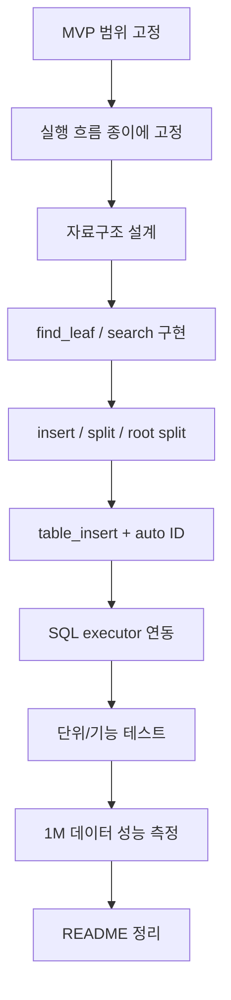

# reum-004 MVP 로드맵과 프로젝트 실행 계획

## 이 문서의 역할

이 문서는 설계 대화 export에 들어 있던 "오늘 하루 안에 이 과제를 어떻게 끝낼 것인가"에 대한 조언을 **실행 계획 문서**로 재정리한 것이다.

핵심 질문은 이거다.

> 이 과제에서 무엇을 먼저 만들고, 무엇을 뒤로 미뤄야 하는가?

---

## 1. 왜 MVP부터 고정해야 하나

MVP는 Minimum Viable Product의 줄임말이다.
아주 쉽게 말하면 **오늘 안에 작동하게 만들 최소 합격선**이다.

이 과제는 범위를 조금만 넓혀도 금방 커진다.

- B+ 트리
- SQL 처리기 연동
- 자동 ID
- 100만 건 성능 비교
- 테스트
- README

여기서 삭제, 디스크 엔진, 동시성까지 넣으면 하루 안에 끝내기 어렵다.

### 표 1. 먼저 해야 할 것 vs 미뤄도 되는 것

| 구분 | 항목 |
| --- | --- |
| 필수 | 자동 ID 부여 |
| 필수 | `id`를 key로 하는 B+ 트리 |
| 필수 | `WHERE id = ?` 인덱스 조회 |
| 필수 | 다른 필드는 선형 탐색 |
| 필수 | 1,000,000건 이상 삽입 |
| 필수 | 성능 비교 |
| 필수 | 단위 테스트 + 기능 테스트 |
| 필수 | README 정리 |
| 보류 | `DELETE` |
| 보류 | 복잡한 `UPDATE` |
| 보류 | 디스크 영속화 전체 |
| 보류 | 동시성 제어 |
| 보류 | 범용 comparator 프레임워크 |

### 왜 이런 식으로 자르나

이 과제의 핵심 평가는 보통 여기에 걸려 있다.

- `id` 검색이 정말 빨라졌는가
- SQL 처리기와 연결되었는가
- 성능 비교가 설득력 있는가
- 테스트와 README가 있는가

즉, **DB 엔진 전체**가 아니라 **인덱스가 실제 검색 경로를 바꿨는가**가 중요하다.

---

## 2. 추천 구현 순서

설계 대화에서 가장 많이 강조된 부분은 이거였다.

> 파서를 크게 뜯기 전에 실행 흐름을 먼저 고정하자.

### 그림 1. 추천 구현 순서



### 표 2. 각 단계의 목적

| 단계 | 목적 |
| --- | --- |
| 범위 고정 | 팀이 어디까지 만들지 합의 |
| 실행 흐름 고정 | SQL과 자료구조 연결을 먼저 단순화 |
| 자료구조 설계 | `Record`, `Table`, `BPTreeNode` 관계 확정 |
| 검색 구현 | 삽입 디버깅 전에 탐색 경로부터 맞춤 |
| 삽입 구현 | leaf split, internal split, root split 완성 |
| `table_insert()` | ID 생성과 인덱스 등록을 한 함수에 모음 |
| executor 연동 | `WHERE id = 정수`만 인덱스 경로로 분기 |
| 테스트 | 구조가 깨지지 않는지 검증 |
| 성능 측정 | 인덱스 사용 효과를 숫자로 확인 |
| README | 발표와 기록 준비 |

### 각 단계가 끝났다고 말할 수 있는 기준

초보자 입장에서는 "언제 다음 단계로 넘어가도 되지?"가 가장 어렵다.
그래서 완료 기준을 같이 두는 것이 좋다.

| 단계 | 최소 완료 기준 |
| --- | --- |
| MVP 범위 고정 | 팀원들이 필수/보류 항목을 같은 말로 설명할 수 있음 |
| 실행 흐름 고정 | INSERT/SELECT 경로를 말이나 그림으로 설명 가능 |
| 자료구조 설계 | `Table`, `Record`, `BPTreeNode`에 어떤 필드가 들어가는지 합의됨 |
| 검색 구현 | 넣은 key가 있으면 찾고, 없으면 miss가 난다는 것이 테스트로 확인됨 |
| 삽입 구현 | split 전후에도 `search()` 결과가 맞음 |
| `table_insert()` | ID 생성, 저장, 인덱스 등록이 한 함수에서 끝남 |
| executor 연동 | `WHERE id = ?`와 그 외 조건이 실제로 다른 경로를 탐 |
| 테스트 | 최소 단위 테스트와 기능 테스트가 자동으로 돌음 |
| 성능 측정 | 반복 횟수, 입력 크기, 비교 대상이 README에 설명 가능함 |

이 표를 보면 설계 문서가 덜 추상적으로 느껴진다.
각 단계는 "예쁘게 완성"이 아니라 "다음 단계로 넘어갈 만큼 안정화"가 기준이다.

---

## 3. 실행 흐름을 먼저 고정하라는 말의 뜻

설계 대화에서 제안된 핵심 흐름은 아래와 비슷했다.

```text
INSERT
-> new_id = next_id++
-> records[row_count]에 저장
-> bptree_insert(new_id, row_index)
-> row_count++

SELECT WHERE id = 123
-> bptree_search(123)
-> row_index 반환
-> records[row_index] 반환

SELECT WHERE name = 'kim'
-> records 전체 선형 탐색
```

이 흐름을 먼저 고정하면 좋은 이유는 두 가지다.

1. SQL 파서 전체를 다시 만들 필요가 줄어든다.
2. 자료구조와 실행기 연결이 명확해진다.

즉, 이번 과제는 **SQL 언어 설계**가 아니라 **인덱스가 실제 경로를 바꾸게 하는 것**에 더 가깝다.

---

## 4. 왜 B+ 트리는 검색부터 구현해야 하나

설계 대화에서는 B+ 트리를 처음부터 한 번에 만들지 말고, 아래 순서를 권했다.

1. `find_leaf(key)`
2. `search(key)`
3. 리프 정렬 삽입
4. 리프 split
5. 부모 separator key 삽입
6. 내부 노드 split
7. root split

### 표 3. 검색부터 시작하는 이유

| 이유 | 설명 |
| --- | --- |
| 디버깅이 쉽다 | 탐색이 맞아야 삽입 결과를 검사할 수 있다 |
| split 검증이 쉬워진다 | 삽입 후 `search()`로 바로 확인 가능 |
| 단계가 자연스럽다 | leaf -> parent -> root 순으로 확장된다 |

### 꼭 지켜야 할 최소 B+ 트리 규칙

| 규칙 | 뜻 |
| --- | --- |
| 내부 노드 | 탐색용 key + child pointer |
| 리프 노드 | 실제 `key -> value` 저장 |
| 리프 연결 | 가능하면 `next`로 연결 |

---

## 5. `table_insert()` 하나로 묶으라는 이유

대화 export에서는 삽입 로직을 반드시 한 함수에 모으라고 했다.

권장 흐름:

1. `id = next_id++`
2. 레코드 생성
3. 테이블 저장소에 append
4. 인덱스에 `id -> row_index` 등록

### 표 4. 한 함수로 모을 때의 장점

| 장점 | 설명 |
| --- | --- |
| ID 생성 위치 통일 | 자동 ID 정책이 한 군데에 모임 |
| 롤백 처리 쉬움 | 저장 성공, 인덱스 실패 같은 상황 처리 가능 |
| 유지보수 쉬움 | 삽입 정책을 한 곳에서 수정 가능 |

### 실패 처리 예시

| 상황 | 처리 예시 |
| --- | --- |
| 레코드 저장 성공 + 인덱스 삽입 실패 | `row_count--` 롤백 |
| ID 생성 후 중복 감지 | 삽입 중단 |
| 메모리 부족 | 삽입 실패 반환 |

이런 작은 처리들이 결과물 완성도를 크게 높인다.

### 신입생이 여기서 자주 하는 실수

| 실수 | 왜 문제인가 |
| --- | --- |
| 저장 로직을 여러 함수에 흩뿌림 | 실패 처리와 디버깅 지점이 늘어난다 |
| `search()`도 없는데 `insert()`부터 크게 짬 | 삽입 결과가 맞는지 확인하기 어려워진다 |
| 인덱스 갱신을 나중으로 미룸 | 테이블과 인덱스 상태가 어긋나기 쉽다 |
| 자동 ID를 parser, executor, storage에 따로 나눠 넣음 | 정책이 여러 군데 흩어져 수정이 어려워진다 |

그래서 `table_insert()` 같은 한 지점에 정책을 모으라는 말은
그냥 취향이 아니라 "상태를 한 군데에서 책임지게 하자"는 뜻이다.

---

## 6. SQL 처리기는 왜 executor만 건드리라고 하나

설계 대화의 추천은 명확했다.

- 파싱 결과가 `WHERE id = <정수>`이면 인덱스 경로
- 그 외 조건은 기존 선형 탐색 경로

즉, **파서를 크게 확장하는 것보다 executor에서 분기하는 방식**이 빠르고 안전하다.

### 표 5. 두 방식 비교

| 방식 | 장점 | 단점 |
| --- | --- | --- |
| 파서/AST 크게 확장 | 구조적으로 예쁠 수 있음 | 시간 많이 듦, 과제 본질에서 멀어질 수 있음 |
| executor에서 패턴 분기 | 빠르고 단순함 | 지원하는 SQL 문법은 제한적 |

### 추천 로그

```text
[INDEX] SELECT * FROM users WHERE id = 100
[SCAN]  SELECT * FROM users WHERE name = 'kim'
```

이런 로그를 남기면:

- 디버깅이 쉬워지고
- 데모 때 인덱스 사용 여부가 눈에 보이고
- README에도 설명하기 좋다

---

## 7. 테스트는 어떻게 붙여야 하나

설계 대화에서는 테스트를 마지막에 몰아 하지 말고, 구현 직후부터 붙이라고 했다.

### 7.1 단위 테스트

| 항목 | 예시 |
| --- | --- |
| 빈 트리 검색 | 아무 것도 없는 상태에서 search |
| 단일 키 삽입/검색 | 1개 넣고 찾기 |
| 오름차순 삽입 | `1,2,3,4...` |
| 내림차순 삽입 | `10,9,8...` |
| 중간 삽입 | `1,3,2` |
| 리프 split | split 직전/직후 |
| 내부 split | 부모 갱신 확인 |
| root split | 트리 높이 증가 확인 |
| 없는 키 검색 | miss 처리 확인 |
| 첫/마지막 키 검색 | 경계값 확인 |

### 7.2 기능 테스트

| 항목 | 질문 |
| --- | --- |
| INSERT 후 `WHERE id = ?` | 인덱스가 바로 갱신되었나 |
| `WHERE name = ?` | 선형 탐색 결과가 맞나 |
| 인덱스 vs 선형 탐색 | 같은 데이터 결과가 일치하나 |
| 재시작/재구축 | 프로그램 시작 시 인덱스가 맞게 준비되나 |

### 7.3 엣지 케이스

| 항목 | 이유 |
| --- | --- |
| 0건 | 빈 상태 처리 |
| 1건 | 최소 상태 확인 |
| split 직전/직후 | 구조 불안정 구간 |
| 아주 큰 ID | 타입/비교 검증 |
| 1,000,000건 | 규모 검증 |

### 7.4 invariant 검사의 의미

설계 대화에서는 `assert_bptree_invariants()` 같은 검증 함수도 강하게 추천했다.

예:

- 키가 정렬되어 있는가
- 노드 키 개수가 규칙 범위에 있는가
- 모든 리프가 같은 깊이에 있는가
- 리프 `next` 연결이 정상인가

이런 검사는 "겉으로 결과가 맞는 것"보다 더 강한 품질 증거가 된다.

### 테스트를 붙일 때 추천 리듬

신입생 기준에서는 테스트를 "거대한 최종 점검"으로 생각하기 쉽다.
하지만 실제로는 아래 리듬이 훨씬 안전하다.

1. 기능 하나를 아주 작게 구현한다
2. 그 기능이 맞는지 보는 가장 작은 테스트를 바로 붙인다
3. 경계값 테스트를 하나 더 붙인다
4. 구조 invariant를 확인한다
5. 그다음 기능으로 넘어간다

예를 들어 리프 split을 구현했다면,
"split이 일어나는 입력", "split 직전 입력", "split 직후 search 결과"
정도를 바로 확인해야 한다.

---

## 8. 성능 테스트는 왜 “공정하게” 설계해야 하나

인덱스가 빠르다는 말을 하려면 비교가 공정해야 한다.

설계 대화에서는 이런 비교를 권했다.

- `WHERE id = ?` : 인덱스 사용, equality 단건 조회
- 다른 필드 equality 조회 : 인덱스 없음, 선형 탐색

### 표 6. 안 좋은 비교 vs 좋은 비교

| 구분 | 예시 | 왜 문제/왜 좋은가 |
| --- | --- | --- |
| 안 좋은 비교 | `WHERE id = ?` 1회 vs `WHERE name = ?` 1회 | 표본이 너무 적음 |
| 좋은 비교 | 랜덤 `id` 10,000회 vs 랜덤 `name` 10,000회 | 통계적으로 더 설득력 있음 |

### 성능 측정 팁

| 팁 | 이유 |
| --- | --- |
| 삽입 시간 따로 | 적재 비용과 조회 비용 분리 |
| 검색 시간 따로 | 인덱스 효과를 선명하게 보기 위해 |
| 워밍업 1회 | 첫 실행 편차 완화 |
| 랜덤 키 반복 조회 | 특정 위치 편향 줄이기 |
| 평균/총합 둘 다 기록 | 설명하기 쉬움 |
| `CLOCK_MONOTONIC` 사용 | 벽시계 시간보다 안정적 |

### 공정한 비교를 더 쉽게 말하면

공정한 비교란
"질문은 비슷한데, 인덱스 유무만 다르게 만드는 것"
이라고 생각하면 된다.

예를 들어 아래 비교는 꽤 공정하다.

- `WHERE id = 100` 같은 단건 equality 검색
- `WHERE name = 'user_00100'` 같은 단건 equality 검색

둘 다 "조건 하나로 한 row를 찾는 질문"이기 때문이다.
이때 차이는 주로 인덱스가 있느냐 없느냐에서 나온다.

반대로
"id로 단건 조회"와 "name으로 범위 검색"을 비교하면
질문 자체가 달라서 성능 차이의 원인을 깔끔하게 설명하기 어려워진다.

### 데이터 생성 패턴 예시

| 필드 | 패턴 예시 |
| --- | --- |
| `name` | `user_%07d` |
| `email` | `u%07d@test.com` |
| `age` | `i % 100` |
| 비교용 다른 필드 | `external_code = i + 1000000` |

---

## 9. 대량 삽입은 SQL로 할까, 내부 API로 할까

대화 export에는 이 고민도 들어 있었다.

### 표 7. 두 방식 비교

| 방식 | 장점 | 단점 |
| --- | --- | --- |
| SQL 100만 건 생성 | SQL 처리기와 완전 연동됨을 보여주기 좋음 | 파싱 오버헤드가 커짐 |
| 내부 API 대량 생성 | 인덱스/저장소 성능을 더 깔끔하게 측정 가능 | “모든 적재가 SQL 경유”는 아님 |

### 현실적인 권장안

- 기능 데모: SQL 경유
- 성능 측정: 내부 API 경유

이렇게 나누면:

- 기능 연동도 보여줄 수 있고
- 파서 성능과 인덱스 성능을 구분할 수 있고
- README 설명도 더 정직해진다

---

## 10. README를 왜 중간부터 써야 하나

README가 발표 자료 역할까지 한다면, 마지막에 급히 쓰면 구조가 약해진다.

설계 대화에서 권장한 README 구성은 아래와 비슷했다.

1. 프로젝트 목표
2. 전체 구조도
3. B+ 트리 핵심 개념
4. `INSERT` / `SELECT` 동작 흐름
5. 테스트 케이스 목록
6. 성능 측정 방법
7. 결과 수치
8. 한계와 개선점

### README에 꼭 넣으면 좋은 설계 판단

| 항목 | 왜 중요한가 |
| --- | --- |
| 왜 `Record*` 대신 `row_index`를 골랐는가 | 저장/인덱스 연결 방식을 설명 |
| 왜 `WHERE id = ?`에만 인덱스를 썼는가 | 요구사항과 직접 연결 |
| 왜 대량 적재는 내부 API를 썼는가 | 성능 측정의 공정성 설명 |

---

## 11. 오늘 하루 기준 시간표 느낌으로 정리하면

### 그림 2. 하루 구현 로드맵

```text
1단계: 범위 고정 + 구조체 설계
2단계: find_leaf, search
3단계: insert, split, root split
4단계: table_insert + auto ID
5단계: SQL executor 연동
6단계: 단위/기능 테스트
7단계: 1M 데이터 + 성능 측정
8단계: README 정리
```

이 순서의 장점은:

- 앞 단계가 뒤 단계의 기반이 되고
- 디버깅이 쉬우며
- 어느 단계에서 막혀도 최소 시연본을 남기기 좋다

---

## 12. 역사와 트렌드는 발표용으로 어느 정도만 알면 되나

대화 export에서는 발표용으로 이 정도만 정리해도 충분하다고 했다.

### 표 8. 짧은 역사/트렌드 정리

| 주제 | 한 줄 설명 |
| --- | --- |
| B-tree 기원 | 디스크 기반 ordered index 문제를 풀기 위해 제안됨 |
| 현대 RDBMS | 여전히 B-tree 계열 인덱스를 equality/range 조회에 널리 사용 |
| 최근 차별화 | 자료구조 자체보다 split, 삭제, 통계, 플래너, 유지보수 최적화가 더 중요해짐 |

즉, 과제 발표에서 핵심은 "B+ 트리가 유명한 자료구조다" 정도가 아니라

- 왜 DB에서 오래 살아남았는가
- 왜 여전히 equality/range 검색에 강한가

를 짧게 아는 것이다.

---

## 13. 시간이 남으면 넣기 좋은 차별화 포인트

설계 대화에서 추천한 추가 구현 요소는 아래와 같았다.

### 표 9. 추가 구현 아이디어

| 아이디어 | 의미 |
| --- | --- |
| `WHERE id BETWEEN a AND b` | leaf `next`를 활용한 range scan 시연 |
| `EXPLAIN` 비슷한 로그 | `INDEX USED` / `FULL SCAN` 표시 |
| 트리 시각화 함수 | 레벨별 키 출력 |
| invariant 검사 함수 | 자료구조 검증 강조 |

이런 기능은 "과제 본체"는 아니지만, 완성도를 높이고 README를 풍부하게 만들어 준다.

---

## 14. 이 문서의 핵심만 다시 요약하면

### 표 10. 핵심만 압축

| 질문 | 답 |
| --- | --- |
| 먼저 뭘 정해야 하나 | MVP 범위 |
| 먼저 뭘 구현해야 하나 | 실행 흐름과 검색 |
| SQL은 어디서 연결하는 게 좋은가 | executor 분기 |
| 테스트는 언제 붙이나 | 구현 직후 바로 |
| 성능 비교는 어떻게 하나 | 같은 종류의 조회를 반복 측정 |
| README는 언제 쓰나 | 중간부터 같이 |

가장 중요한 한 줄은 이거다.

> 오늘의 목표는 "완전한 DBMS"가 아니라  
> "`WHERE id = ?`가 정말 인덱스를 타는 최소 엔진"을 먼저 완성하는 것이다.
