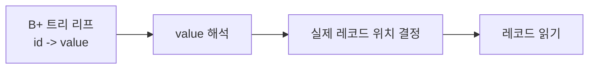
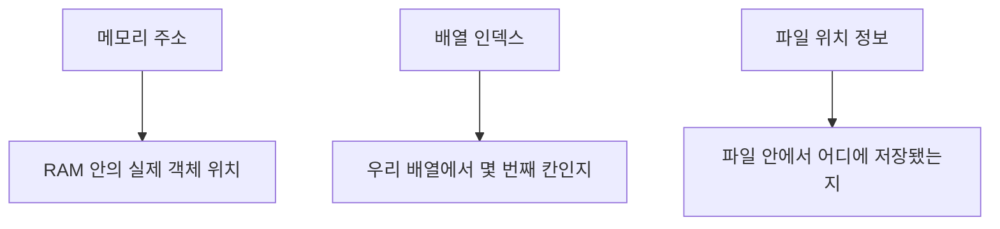
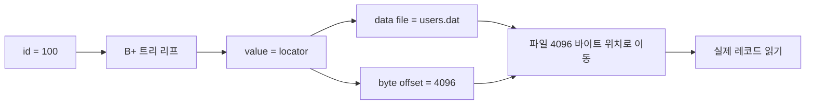
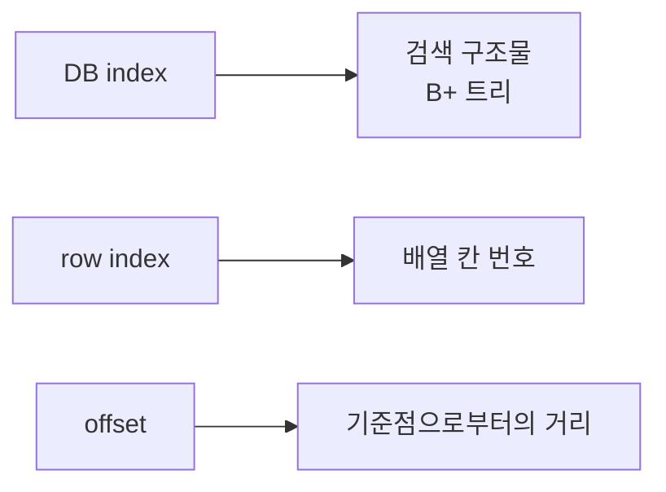

# reum-006 위치 정보와 저장 형식: `row_index`, `offset`, `locator`를 이해하는 문서

## 이 문서의 역할

설계 단계 대화에서 가장 많이 헷갈렸던 부분은 사실 B+ 트리 자체보다도 이쪽이었다.

- 리프 노드의 `value`에는 뭘 넣는가
- `row_index`는 뭔가
- `offset`은 뭔가
- `path + offset`은 포인터인가, 주소인가
- 레코드 길이를 왜 정해야 하는가

이 문서는 그 질문들을 한 군데에 모아
**"데이터를 어디에 두고, 인덱스가 그 데이터를 어떻게 찾아가게 할 것인가"**
를 이해하기 쉽게 풀어낸다.

---

## 0. 제일 짧은 답부터

### 표 1. 가장 먼저 잡아야 할 단어

| 단어 | 아주 짧은 뜻 |
| --- | --- |
| `value` | B+ 트리가 실제 레코드를 다시 찾기 위해 들고 있는 정보 |
| `row_index` | 배열에서 몇 번째 row인지 나타내는 번호 |
| `offset` | 어떤 기준점에서 얼마나 떨어져 있는지 나타내는 값 |
| `locator` | 실제 데이터 위치를 표현하는 정보 묶음 |
| 메모리 주소 | 지금 실행 중인 RAM 안의 실제 주소 |
| 파일 위치 정보 | 파일 안에서 몇 바이트 지점에 데이터가 있는지 |

### 가장 중요한 한 줄

> B+ 트리 리프의 `value`는 "데이터 자체"일 수도 있지만,  
> 이번 과제에서는 보통 "데이터를 다시 찾는 위치 정보"로 이해하는 편이 훨씬 쉽다.

---

## 1. 왜 하필 리프의 `value`가 중요하냐

B+ 트리에서 리프는 보통 이런 모양이다.

```text
key -> value
id  -> ?
```

여기서 이번 과제의 `key`는 거의 `id`다.
그러면 남는 질문은 하나다.

> `id`를 찾았을 때, 그 다음에 실제 레코드를 어떻게 찾을 건데?

바로 그 질문의 답이 `value`다.

### 그림 1. 인덱스와 실제 데이터의 관계



즉, `value`는 "다음 이동 경로"를 알려주는 힌트다.

---

## 2. 가장 흔한 `value` 선택지 4개

### 표 2. 리프 value 후보 비교

| 선택지 | 뜻 | 장점 | 단점 | 이번 과제 적합성 |
| --- | --- | --- | --- | --- |
| `Record*` | 메모리 주소를 직접 저장 | 한 번에 바로 접근 가능 | `realloc()` 등으로 주소가 바뀌면 위험 | 보통 비추천 |
| `row_index` | 배열에서 몇 번째 row인지 저장 | 단순하고 안전함 | 배열이라는 저장소가 전제됨 | 가장 추천 |
| 레코드 전체 | 리프에 데이터 자체를 저장 | 찾은 즉시 데이터 사용 가능 | 리프가 무거워지고 split이 복잡 | 과함 |
| locator | 파일 경로, 파일 ID, offset 등 위치 정보 | 디스크 기반 확장 스토리가 좋음 | 저장 형식 설계가 커짐 | 이번 과제엔 무거움 |

### 한 문장씩 다시 말하면

- `Record*` 는 "RAM 안의 이 주소로 가라"
- `row_index` 는 "배열의 57번째 칸으로 가라"
- 레코드 전체는 "찾은 자리에서 바로 데이터가 나온다"
- locator는 "파일의 이 위치로 가라"

---

## 3. 메모리 주소, 배열 인덱스, 파일 위치 정보는 어떻게 다른가

이 세 개를 헷갈리면 뒤에 나오는 모든 말이 섞여버린다.

### 표 3. 세 위치 표현 방식의 차이

| 구분 | 예시 | 의미 | 유효 범위 |
| --- | --- | --- | --- |
| 메모리 주소 | `0x7ffd12345678` | 지금 프로세스 RAM 안의 실제 주소 | 실행 중인 그 프로그램 안 |
| 배열 인덱스 | `57` | `records[57]` 의 57 | 그 배열이 유지되는 동안 |
| 파일 위치 정보 | `users.dat + 4096` | 파일 안의 4096 바이트 지점 | 파일 포맷이 유지되는 동안 |

### 그림 2. 세 방식의 직관적인 차이



### 왜 `row_index`가 초보자에게 특히 좋은가

- 숫자 하나라서 다루기 쉽고
- `records[57]`처럼 눈으로 바로 연결되고
- 동적 배열이 커져서 내부 메모리 주소가 바뀌어도 "57번째 칸"이라는 뜻은 유지되기 쉽다

### C 배열을 기준으로 다시 보면

예를 들어 아래처럼 생각해보자.

```c
Record records[3];
```

그러면

- `records[0]`은 첫 번째 칸
- `records[1]`은 두 번째 칸
- `records[2]`은 세 번째 칸

이다.

여기서 `row_index = 1` 이라는 말은
"두 번째 칸에 저장된 레코드"라는 뜻이지,
"1바이트 떨어진 위치"라는 뜻이 아니다.

이 차이를 머릿속에 넣어두면
`index`, `offset`, `address`가 서로 다른 개념이라는 점이 훨씬 선명해진다.

---

## 4. 팀이 말한 `base_pointer + offset`은 정확히 뭐냐

설계 대화에서 나온 표현은

```text
base_pointer + offset
```

이었지만, 실제 뜻은 보통 C 포인터 연산이 아니라
**"어떤 저장 기준점 + 얼마나 떨어졌는지"** 에 더 가깝다.

### 표 4. 이름을 더 정확히 바꾸면

| 원래 표현 | 더 정확한 표현 |
| --- | --- |
| `base_pointer + offset` | `record locator` |
| `base_pointer` 가 path인 경우 | `file_path` 또는 `data_file_path` |
| `offset` | `byte_offset` |

### 왜 `project root + offset`은 애매하냐

레코드는 보통 "프로젝트 폴더" 안에 저장되는 게 아니라
**특정 데이터 파일 안**에 저장된다.

그래서 기준점은 보통 이쪽이어야 한다.

```text
"./data/users.dat" + 1024 bytes
```

이건 의미가 분명하다.
반면 이건 애매하다.

```text
"/project-root" + 1024
```

프로젝트 루트에서 1024 바이트 떨어진 지점이 곧 레코드 위치라는 뜻은 아니기 때문이다.

### 그림 3. locator의 더 자연스러운 해석



---

## 5. `path + offset`은 넓게 보면 어떤 선택지에 속하나

이건 `Record*` 와 같은 메모리 포인터 방식은 아니다.
더 정확히는 **locator 방식**이다.

### 표 5. `Record*`, `row_index`, `path + offset` 비교

| 방식 | 실제로 가리키는 것 | 성격 |
| --- | --- | --- |
| `Record*` | RAM 안의 객체 | 메모리 주소 방식 |
| `row_index` | 배열의 몇 번째 원소 | 메모리 위치 번호 방식 |
| `path + offset` | 파일 안의 저장 위치 | 저장소 locator 방식 |

즉, `path + offset`은
"레코드 자체"를 넣는 방식이 아니라
"레코드를 다시 찾는 위치 정보"를 넣는 방식의 한 종류다.

---

## 6. "진짜 파일 기반"과 "주소 비슷한 개념"은 다르다

이 표현은 대화에서 특히 혼란을 줬던 부분이다.

### 경우 A. 진짜 파일 기반

이 경우에는 레코드가 실제로 파일에 저장된다.

```text
실제 데이터: users.dat 파일
인덱스 value: byte offset
조회: fseek() / fread() 로 파일에서 다시 읽기
```

### 경우 B. 주소 비슷한 개념만 쓰는 경우

이 경우에는 실제 데이터는 메모리 배열에 있고,
그냥 위치를 나타내는 숫자만 쓰는 것이다.

```text
실제 데이터: records 배열
인덱스 value: row_index
조회: records[row_index]
```

### 표 6. 두 경우 비교

| 항목 | 진짜 파일 기반 | 주소 비슷한 개념 |
| --- | --- | --- |
| 실제 저장 위치 | 파일 | 메모리 배열 |
| value 예시 | `4096 bytes` | `57` |
| 읽는 방법 | `fseek`, `fread` | 배열 접근 |
| 추가 설계 필요성 | 큼 | 작음 |
| 이번 과제 적합성 | 낮음 | 높음 |

### 왜 이 구분이 중요한가

둘 다 "위치 정보"를 쓴다는 점은 비슷하지만,
구현 난이도는 전혀 다르다.

---

## 7. `index` 와 `offset` 은 왜 다르냐

이 질문은 용어가 비슷하게 생겨서 자주 나온다.

### 표 7. `index` 와 `offset`의 차이

| 단어 | 핵심 뜻 | 예시 |
| --- | --- | --- |
| `index` | 순번 또는 검색용 구조 | `records[5]`, `DB index` |
| `offset` | 기준점으로부터의 거리 | 파일 시작점에서 4096 바이트 |

### 그런데 `index` 는 사실 두 뜻이 있다

#### 1. DB 인덱스

```text
"우리는 id에 인덱스를 만들었다"
```

여기서 인덱스는 B+ 트리 같은 **검색 자료구조**를 뜻한다.

#### 2. 배열 인덱스

```text
records[5]
```

여기서 인덱스는 **몇 번째 칸인지**를 뜻한다.

### 그림 4. 자주 헷갈리는 세 단어



### 정리

- `B+ tree index` = 검색 구조
- `row index` = 배열 칸 번호
- `offset` = 몇 바이트 떨어졌는가

셋은 전부 다르다.

---

## 8. `offset`을 쓰려면 row 크기를 꼭 똑같이 맞춰야 하냐

정답은 "반은 맞고 반은 아니다"다.

### 경우 1. offset을 계산으로 구할 때

예를 들어

```text
offset = row_index * record_size
```

이렇게 계산해서 위치를 얻으려면,
모든 레코드 크기가 같아야 한다.

### 이유

첫 번째 row가 32바이트,
두 번째 row가 100바이트,
세 번째 row가 20바이트라면
세 번째 row의 시작 위치를 단순 곱셈으로 계산할 수 없다.

### 경우 2. offset을 따로 저장할 때

예를 들어 삽입 시 실제 시작 위치를 함께 기록한다면,

```text
id 100 -> offset 213
id 101 -> offset 387
id 102 -> offset 441
```

이 경우에는 레코드 길이가 꼭 같을 필요는 없다.
대신 다른 문제가 생긴다.

### 표 8. 계산형 offset vs 저장형 offset

| 방식 | 장점 | 단점 |
| --- | --- | --- |
| 계산형 offset | 단순하고 빠름 | 고정 길이 레코드가 필요함 |
| 저장형 offset | 가변 길이도 가능 | 길이 관리, 직렬화, 수정 처리까지 복잡해짐 |

### 숫자로 계산해 보는 offset

고정 길이 레코드가 정말 왜 쉬운지 아주 짧게 계산해보자.

가정:

- 레코드 하나의 크기 = 64바이트
- `row_index = 0`인 레코드 시작 위치 = 0

그러면:

| `row_index` | 계산식 | `offset` |
| --- | --- | --- |
| 0 | `0 * 64` | 0 |
| 1 | `1 * 64` | 64 |
| 2 | `2 * 64` | 128 |
| 3 | `3 * 64` | 192 |

즉, 고정 길이 레코드는
"몇 번째 row인지"만 알면
"파일 어디서 시작하는지"를 바로 계산할 수 있다.

반대로 가변 길이라면
앞 레코드들의 길이를 다 알아야 해서 계산이 훨씬 까다로워진다.

---

## 9. 여기서 알아두면 좋은 추가 기반 지식

이 부분은 export 대화에 직접 이름이 많이 나오진 않았지만,
그 내용을 이해하려면 꼭 필요한 배경지식이다.

### 9.1 바이트(byte)

파일의 위치는 보통 "몇 번째 레코드"가 아니라
"파일 시작점에서 몇 바이트 떨어졌는가"로 표현한다.

### 9.2 직렬화(serialization)

메모리 안의 구조체를 파일에 저장 가능한 형태로 바꾸는 과정이다.

예:

- 문자열 길이를 같이 저장할지
- 고정 길이 버퍼로 저장할지
- CSV처럼 텍스트로 저장할지
- 바이너리 레이아웃으로 저장할지

### 9.3 레코드 레이아웃(record layout)

레코드가 파일 안에서 어떤 모양으로 저장되는지에 대한 설계다.

예:

- `id` 8바이트
- `name` 32바이트 고정
- `age` 4바이트

### 9.4 고정 길이 레코드와 가변 길이 레코드

| 구분 | 뜻 | 장점 | 단점 |
| --- | --- | --- | --- |
| 고정 길이 | 모든 row 크기가 같음 | offset 계산이 쉬움 | 공간 낭비 가능 |
| 가변 길이 | row마다 크기가 다를 수 있음 | 공간 활용이 좋음 | 위치 관리가 복잡 |

### 9.5 논리적 위치와 물리적 위치

| 종류 | 예시 |
| --- | --- |
| 논리적 위치 | `row_index = 57` |
| 물리적 위치 | `users.dat + 4096 bytes` |

초보자 입장에서는
"논리적 위치는 프로그램 안에서 편하게 쓰는 번호",
"물리적 위치는 실제 저장 장치상의 위치"
정도로 이해해도 충분하다.

### 왜 포인터를 바로 value로 두는 방식이 초보자에게 위험할 수 있나

`Record*` 방식은 처음 보면 가장 직접적이라 쉬워 보인다.
하지만 아래 이유 때문에 입문 단계에서는 오히려 헷갈릴 수 있다.

| 이유 | 설명 |
| --- | --- |
| 주소가 바뀔 수 있음 | 동적 배열이 커지면서 재할당되면 내부 주소가 달라질 수 있다 |
| 실행이 끝나면 무의미 | 포인터는 현재 실행 중인 프로세스 안에서만 의미가 있다 |
| 디버깅이 어려움 | `0x7ffe...` 같은 숫자는 초보자에게 의미가 잘 안 보인다 |
| 설명이 어려움 | README나 발표에서 `row_index`보다 직관성이 떨어질 수 있다 |

그래서 입문용 구현에서는
"주소 그 자체"보다
"몇 번째 칸인지" 같은 논리적 위치가 더 친절한 경우가 많다.

---

## 10. 파일 기반 locator 방식을 쓰려면 무엇을 더 정해야 하나

이건 설계 대화에서 매우 중요한 포인트였다.

### 표 9. 파일 locator 방식의 추가 설계 항목

| 질문 | 왜 필요한가 |
| --- | --- |
| 실제 레코드를 정말 파일에 저장하나 | 메모리 기반인지 파일 기반인지 갈림 |
| 기준 파일은 무엇인가 | 프로젝트 루트가 아니라 보통 특정 데이터 파일 |
| value는 `offset`만 넣나, `path + offset`을 넣나 | 중복 정보 여부와 구조 설계에 영향 |
| offset 기준점은 무엇인가 | 파일 시작점, 페이지 시작점 등 |
| 레코드 길이는 고정인가 가변인가 | 위치 계산 방식이 달라짐 |
| 문자열은 어떻게 저장하나 | 직렬화 설계 필요 |
| 수정/삭제 시 위치가 바뀌면 어떻게 하나 | locator 유효성 문제 |

즉, locator 방식은 단순히 value 타입 하나 고르는 일이 아니라
**저장소 엔진 설계의 시작점**이 된다.

---

## 11. 이번 과제에 맞는 가장 현실적인 추천안

대화 export 전체를 실습 과제 관점으로 정리하면 추천안은 명확하다.

### 추천 구조

```text
실제 데이터: records 동적 배열
인덱스 value: row_index
id 검색: id -> row_index -> records[row_index]
다른 필드 검색: records 전체 선형 탐색
```

### 왜 이게 좋은가

| 이유 | 설명 |
| --- | --- |
| 과제 요구사항과 잘 맞음 | 메모리 기반 단순화 구현과 자연스럽게 맞는다 |
| 구현이 빠름 | 파일 포맷, 직렬화, 오프셋 계산을 크게 줄인다 |
| 설명이 쉬움 | 발표나 README에서 흐름이 잘 보인다 |
| 테스트가 쉬움 | 배열과 트리의 대응 관계를 확인하면 된다 |

### 현재 프로젝트에 연결해서 보면

이 문서의 개념을 프로젝트에 대입하면 아래처럼 읽을 수 있다.

1. 실제 데이터는 어떤 저장소에 들어간다
2. 인덱스는 `id`를 key로 사용한다
3. 인덱스 value는 "실제 데이터를 다시 찾기 위한 힌트"다
4. 그 힌트가 `row_index`일 수도 있고 `offset`일 수도 있다
5. 어떤 힌트를 고르느냐에 따라 저장 구조와 코드 복잡도가 달라진다

즉, 이 문서는 단순히 용어 해설이 아니라
"B+ 트리 리프 value를 무엇으로 둘 것인가"
라는 설계 질문을 이해하기 위한 기반 문서다.

### 한 문장 추천

> 이번 과제에서는 locator 개념을 배울 수는 있지만,  
> 구현은 `id -> row_index`로 단순화하는 것이 가장 안전하다.

---

## 12. FAQ: 설계 대화의 질문/답변을 짧게 다시 보면

### Q. `path + offset`도 네가 말한 선택지 안에 있던 거야?

A. 그렇다. 넓게 보면 "실제 레코드를 찾는 위치 정보(locator)" 방식의 한 종류다.

### Q. 그럼 `path + offset`은 포인터야?

A. C의 메모리 포인터라기보다 파일 위치를 표현하는 locator에 더 가깝다.

### Q. `row_index`가 뭐야?

A. `records[57]` 의 57처럼 배열에서 몇 번째 row인지 나타내는 번호다.

### Q. `offset`과 `index` 차이는 뭐야?

A. `index`는 순번이나 검색 구조를 뜻하고, `offset`은 기준점으로부터의 거리다.

### Q. offset을 쓰려면 row 크기를 꼭 같게 해야 해?

A. 계산형 offset이면 거의 그렇다. 실제 offset을 따로 저장한다면 꼭 같을 필요는 없지만 설계가 복잡해진다.

### Q. 메모리 주소, 배열 인덱스, 파일 위치 정보 차이는?

A. 각각 RAM 위치, 배열 칸 번호, 파일 안 위치다.

### Q. 지금 프로젝트에는 어떤 방식이 가장 잘 맞아?

A. 메모리 배열 + `id -> row_index` 방식이 가장 단순하고 안전하다.

---

## 13. 스스로 이해했는지 확인하는 체크리스트

- B+ 트리 리프의 `value`가 왜 필요한지 설명할 수 있다
- `Record*`, `row_index`, locator의 차이를 말할 수 있다
- `row_index`와 `offset`을 구분할 수 있다
- 왜 파일 locator 방식이 더 무거운 설계인지 말할 수 있다
- 왜 이번 과제에서 `id -> row_index`가 자주 추천되는지 설명할 수 있다

---

## 다음에 읽으면 좋은 문서

- 메모리 기반 구현이 실제로 어떻게 움직이는지 보고 싶으면: `reum-007`
- 설계 선택지를 다시 전체 그림으로 보고 싶으면: `reum-005`
