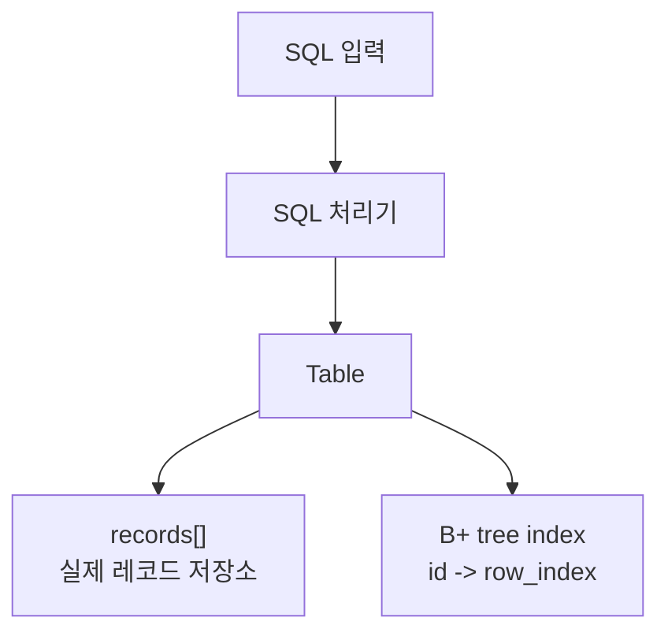
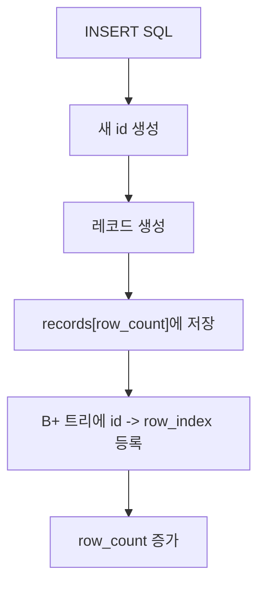
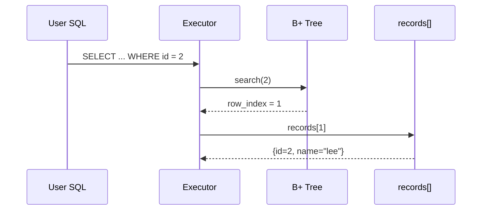
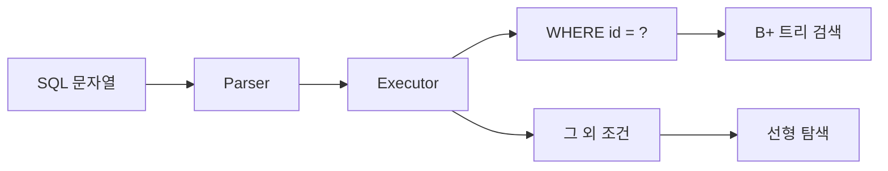

# reum-007 메모리 기반 구현 흐름과 인덱스 사용법

## 이 문서의 역할

이 문서는 설계 대화 export의 마지막 큰 질문,

> "메모리 기반으로 구현하면 어떤 흐름으로 흘러가고, 인덱스는 도대체 뭘 하는가?"

에 답하기 위해 만들었다.

핵심 목표는 딱 두 가지다.

- 메모리 기반 구현의 전체 흐름을 머릿속에 그릴 수 있게 하기
- `WHERE id = ?` 에서 "인덱스를 쓴다"는 말이 실제로 무슨 뜻인지 이해하게 하기

---

## 0. 가장 짧은 요약

> 메모리 기반 구현은 실제 레코드도 메모리에 두고,  
> B+ 트리 인덱스도 메모리에 두고,  
> `id` 검색일 때만 트리를 먼저 거쳐 실제 데이터 위치를 빨리 알아내는 방식이다.

---

## 1. 먼저 "인덱스"가 뭐냐

데이터베이스에서 인덱스는
**데이터를 빨리 찾기 위해 따로 만든 보조 자료구조**다.

### 책 비유

- 책 본문 = 실제 테이블 데이터
- 책 뒤의 찾아보기 = 인덱스

책 뒤에서 "B+ 트리 -> 120페이지"를 찾으면
본문을 처음부터 끝까지 읽지 않아도 된다.

DB도 마찬가지다.

### 표 1. 인덱스가 없을 때와 있을 때

| 경우 | 동작 |
| --- | --- |
| 인덱스 없음 | 데이터 전체를 하나씩 비교 |
| 인덱스 있음 | 인덱스에서 위치를 먼저 찾은 뒤 바로 이동 |

---

## 2. 메모리 기반 구현은 무슨 뜻이냐

메모리 기반 구현은
"복잡한 디스크 엔진 전체를 만들기보다, 일단 RAM 안에서 돌아가게 단순화한 구현"
이라고 생각하면 된다.

### 그림 1. 메모리 기반 버전의 큰 구조



여기서 핵심은 둘 다 메모리에 있다는 점이다.

- `records[]` 도 메모리
- B+ 트리 노드도 메모리
- 검색 결과도 메모리에서 바로 가져온다

---

## 3. 가장 흔한 자료구조 조합

설계 대화에서 가장 자주 추천된 구조는 이것이다.

```c
Table
 ├─ records[]      // 실제 레코드들
 ├─ row_count
 ├─ next_id
 └─ bptree_index   // id -> row_index
```

### 표 2. 각 부품의 역할

| 부품 | 역할 |
| --- | --- |
| `records[]` | 실제 데이터를 보관 |
| `row_count` | 현재 몇 개의 row가 있는지 기록 |
| `next_id` | 다음 INSERT 때 줄 자동 ID |
| `bptree_index` | `id`로 실제 위치를 빨리 찾기 위한 구조 |

### `id -> row_index` 는 무슨 뜻이냐

예를 들어 이런 상태라고 하자.

```text
records[0] = {id=1, name="kim"}
records[1] = {id=2, name="lee"}
records[2] = {id=3, name="park"}
```

그러면 인덱스는 개념적으로 이렇게 된다.

```text
1 -> 0
2 -> 1
3 -> 2
```

즉, `id=2` 를 찾으면
"실제 데이터는 `records[1]` 에 있다"는 뜻이다.

### 이 구조를 문장으로 외우면

신입생 기준에서는 구조를 표보다 문장으로 외우는 편이 더 쉬울 수 있다.

> 테이블은 실제 데이터를 들고 있고,  
> B+ 트리는 그 데이터를 빨리 찾기 위한 위치 정보를 들고 있다.

이 한 문장만 기억해도
"왜 인덱스가 있는데도 다시 `records[]`를 보지?"
같은 질문이 훨씬 덜 헷갈린다.

---

## 4. INSERT는 실제로 어떤 순서로 흘러가냐

메모리 기반 구현에서 INSERT의 핵심은
"실제 저장소"와 "인덱스"를 함께 갱신하는 것이다.

### 그림 2. INSERT 흐름



### 단계별 설명

#### 1. ID 자동 생성

```text
new_id = next_id++
```

#### 2. 실제 레코드 생성

```text
{id=new_id, name="kim", ...}
```

#### 3. 테이블 저장소에 저장

```text
records[row_count] = 새 레코드
```

#### 4. 인덱스에도 등록

```text
id -> row_index
```

즉, 인덱스는
"이 id의 실제 데이터는 records 배열 몇 번째 칸에 있다"
를 기억해둔다.

### 왜 저장소와 인덱스를 둘 다 갱신해야 하나

여기서 중요한 점은
"실제 데이터 저장"과
"검색용 인덱스 갱신"이 서로 다른 일이라는 것이다.

예를 들어 레코드는 저장했는데 인덱스를 안 바꾸면,
데이터는 있는데 `WHERE id = ?` 로 못 찾는 이상한 상태가 된다.

반대로 인덱스만 바꾸고 실제 데이터를 저장하지 않으면,
인덱스는 그 row가 있다고 말하는데 실제 데이터는 없는 상태가 된다.

그래서 INSERT는 보통 아래 두 가지를 함께 맞춰야 한다.

1. 저장소에 실제 row를 넣는다
2. 인덱스에 그 row 위치를 등록한다

이 두 상태가 계속 같은 내용을 가리키는 것을
아주 넓게 보면 "일관성(consistency)"이라고 생각해도 좋다.

### 아주 짧은 코드 느낌

```c
int row_index = table->row_count;

Record r;
r.id = table->next_id++;

table->records[row_index] = r;
bptree_insert(table->index, r.id, row_index);
table->row_count++;
```

---

## 5. `WHERE id = ?` 는 왜 빨라지냐

이번 과제의 핵심 검색 경로다.

예:

```sql
SELECT * FROM users WHERE id = 2;
```

### 그림 3. 인덱스 사용 조회 흐름



### 단계별로 쓰면

1. 실행기가 `WHERE` 조건이 `id = 2` 인지 확인한다
2. B+ 트리에서 key `2` 를 찾는다
3. value `1` 을 얻는다
4. `records[1]` 로 간다
5. 실제 레코드를 반환한다

### 핵심

이때 전체 데이터를 처음부터 끝까지 다 보지 않는다.
먼저 인덱스에서 위치를 찾고,
그 위치로 바로 간다.

### `row_index`를 얻은 뒤 왜 다시 `records[]`로 가나

초보자에게는 여기서 이런 의문이 생길 수 있다.

> 이미 B+ 트리에서 찾았는데, 왜 또 배열로 가요?

답은 간단하다.
인덱스는 보통 "데이터 자체"보다 "데이터 위치"를 저장하기 때문이다.

즉,

- B+ 트리는 "어디 있는지"를 알려주고
- `records[]`는 "실제 내용이 무엇인지"를 보여준다

책 비유로 다시 말하면
인덱스는 페이지 번호를 알려주고,
본문은 실제 내용을 담고 있는 셈이다.

---

## 6. `WHERE name = ?` 는 왜 느리냐

예:

```sql
SELECT * FROM users WHERE name = 'lee';
```

이번 과제에서는 보통 `name` 에 대한 인덱스가 없다.
그러면 할 수 있는 방법은 하나다.

```text
records[0].name == "lee" ?
records[1].name == "lee" ?
records[2].name == "lee" ?
...
```

이걸 **선형 탐색(linear scan)** 이라고 한다.

### 표 3. 두 SELECT 경로 비교

| 쿼리 | 경로 |
| --- | --- |
| `WHERE id = ?` | B+ 트리 인덱스 사용 |
| `WHERE name = ?` | `records[]` 전체 선형 탐색 |

즉, 이번 과제는
"인덱스 사용 경로"와 "인덱스 없는 경로"의 차이를 보여주는 과제라고 봐도 된다.

---

## 7. "인덱스를 사용한다"는 말의 정확한 뜻

이 말은 추상적으로 들리지만 실제 뜻은 꽤 단순하다.

> 데이터를 처음부터 끝까지 모두 비교하지 않고,  
> 검색용 자료구조를 먼저 보고  
> 실제 데이터 위치를 바로 알아낸 뒤  
> 그 위치의 데이터만 읽는 것

### 표 4. 인덱스 사용 전후의 차이

| 구분 | 동작 이미지 |
| --- | --- |
| 인덱스 없음 | `1번 row`, `2번 row`, `3번 row`를 차례로 확인 |
| 인덱스 사용 | `B+ 트리 검색 -> 위치 획득 -> 해당 row만 읽기` |

---

## 8. B+ 트리 안에서는 실제로 뭐가 일어나냐

B+ 트리는 정렬된 트리 구조다.
키가 많아져도 한 번에 전체를 다 보지 않고,
위에서 아래로 범위를 좁혀 내려간다.

### 간단한 그림

```text
          [20 | 50]
         /    |    \
   [5 10 15] [20 30] [50 70 90]
```

예를 들어 `30` 을 찾고 싶으면

1. 루트에서 30이 어느 구간에 속하는지 판단
2. 해당 자식으로 내려감
3. 최종 리프에서 30을 찾음
4. 연결된 value를 얻음

즉, 트리는 "후보를 단계적으로 줄여가는 구조"라고 이해하면 된다.

### search를 손으로 따라가 보기

위 그림에서 `70`을 찾는다고 해보자.

```text
          [20 | 50]
         /    |    \
   [5 10 15] [20 30] [50 70 90]
```

생각 순서는 아래와 같다.

1. 루트에서 `70`을 본다
2. `70`은 `50`보다 크므로 오른쪽 자식으로 내려간다
3. 오른쪽 리프 `[50 70 90]`에서 `70`을 찾는다
4. 그 key에 연결된 value, 예를 들어 `row_index = 8`을 얻는다
5. 실제로는 `records[8]`을 읽는다

이 흐름에서 중요한 점은
"70과 상관없는 key들"을 전부 보지 않는다는 것이다.
트리는 위에서 아래로 내려가며 후보를 줄여준다.

---

## 9. SQL 처리기와는 어디서 연결되냐

설계 대화에서 가장 현실적인 추천은
"executor에서 `WHERE id = 정수` 인 경우만 인덱스 경로로 분기하자"
였다.

### 이유

- 파서를 크게 뜯지 않아도 된다
- 이번 과제의 핵심인 검색 경로 변경에 집중할 수 있다
- 구현이 빠르고 안정적이다

### 그림 4. SQL 처리기 연결 지점



즉, SQL 문법 전체를 다시 설계하는 것보다
실행기에서 조회 경로를 갈라주는 편이 과제 목적에 더 맞는다.

---

## 10. 메모리 기반 구현은 어디까지 단순화하냐

실제 DBMS는 훨씬 많은 부품을 가진다.

### 표 5. 실제 DBMS와 이번 과제의 차이

| 실제 DBMS | 이번 과제의 메모리 기반 버전 |
| --- | --- |
| 디스크 페이지 관리 | 보통 생략 |
| 버퍼 매니저 | 보통 생략 |
| WAL / 복구 | 생략 |
| 동시성 제어 | 생략 |
| 복잡한 옵티마이저 | 생략 |
| B+ 트리 인덱스 | 핵심 구현 대상 |
| 테이블 저장소 | 단순 배열/간단한 파일 |
| SQL 처리기 | 기존 미니 SQL 처리기 재사용 |

즉, 이번 과제는
"진짜 DBMS 전체"가 아니라
"id 검색용 인덱스가 붙은 작은 테이블 시스템"을 만드는 것에 가깝다.

### 메모리 기반이라는 말 때문에 자주 생기는 오해

| 오해 | 실제로는 |
| --- | --- |
| 메모리 기반이면 파일이 완전히 없어야 한다 | 핵심은 인덱스와 실행 경로를 메모리 중심으로 단순화했다는 뜻에 더 가깝다 |
| 메모리 기반이면 DB가 장난감이라는 뜻이다 | 실제 DB의 핵심 아이디어를 작게 압축한 교육용 모델일 수 있다 |
| 메모리 기반이면 인덱스가 필요 없다 | 데이터가 많아지면 메모리 안에서도 인덱스는 여전히 중요하다 |
| 배열만 있으면 충분하다 | 특정 key로 빨리 찾고 싶다면 별도 검색 구조가 필요하다 |

즉, 메모리 기반이라는 말은
"덜 중요하다"는 뜻이 아니라
"핵심 아이디어만 남기고 나머지 복잡성을 줄였다"는 뜻에 가깝다.

---

## 11. 시간 복잡도 관점에서 보면 왜 차이가 나냐

초보자에게는 이 부분도 같이 연결해두면 좋다.

### 표 6. 큰 그림의 성능 감각

| 작업 | 감각적인 설명 |
| --- | --- |
| 선형 탐색 | 데이터가 많아질수록 거의 전부를 봐야 할 수 있음 |
| B+ 트리 검색 | 트리 높이만 따라 내려가면 되므로 훨씬 적은 단계로 좁혀짐 |

정확한 수학 표기보다 중요한 건 이 감각이다.

> 데이터가 100만 건으로 커질수록,  
> 전체를 다 뒤지는 방식과 트리로 바로 찾아가는 방식의 차이가 커진다.

---

## 12. 아주 간단한 예시를 끝까지 따라가 보기

처음 상태:

```text
records = []
B+ tree = empty
next_id = 1
```

### 첫 번째 INSERT

```sql
INSERT INTO users (name) VALUES ('kim');
```

결과:

```text
records[0] = {id=1, name="kim"}
B+ tree: 1 -> 0
next_id = 2
```

### 두 번째 INSERT

```sql
INSERT INTO users (name) VALUES ('lee');
```

결과:

```text
records[0] = {id=1, name="kim"}
records[1] = {id=2, name="lee"}

B+ tree:
1 -> 0
2 -> 1
```

### 이제 조회

```sql
SELECT * FROM users WHERE id = 2;
```

실행:

```text
B+ tree에서 2 찾음
-> row_index 1 반환
-> records[1] 반환
-> {id=2, name="lee"}
```

이 흐름이 바로
"인덱스를 사용한 조회"다.

### INSERT와 SELECT를 한 번에 연결해서 보면

이 프로젝트를 한 문단으로 설명하면 사실 아래와 같다.

1. INSERT가 들어오면 새 row를 저장소에 넣는다
2. 같은 순간 `id -> row_index`를 인덱스에 등록한다
3. 나중에 `WHERE id = ?` 조회가 들어오면 인덱스가 row 위치를 바로 알려준다
4. 그 위치의 실제 row를 읽어 결과를 만든다

즉, INSERT 때 미리 "찾아보기"를 만들어 두고,
SELECT 때 그 찾아보기를 활용하는 구조다.

---

## 13. 이 프로젝트의 두 버전을 이해하려면

이 섹션은 export 대화와 현재 프로젝트를 연결해서 보기 위한 것이다.

### 표 7. 이전 버전과 현재 방향의 차이

| 항목 | 이전 쪽 감각 | 현재 정리된 방향 |
| --- | --- | --- |
| 인덱스 위치 | 파일 기반 인덱스에 더 가까웠음 | 메모리 B+ 트리 중심 |
| INSERT | 사용자가 id를 직접 넣는 흐름이 강했음 | 자동 ID 부여 |
| `WHERE id = ?` | 인덱스 사용 목표는 있었음 | 메모리 인덱스 검색으로 단순화 |
| 비-id 조회 | 지원이 약하거나 분리되어 있었음 | 같은 SQL 처리기 안에서 선형 탐색 |
| 설계 설명 | locator/file 감각이 섞여 있었음 | `id -> row_index` 중심으로 명확화 |

### 왜 이 변화가 중요하냐

이전 버전은 "DB스럽다"는 느낌은 있었지만
과제 요구사항인 "메모리 기반 단순화 구현"과는 조금 어긋나는 부분이 있었다.

현재 방향은

- 메모리 기반
- 자동 ID
- `WHERE id = ?` 인덱스 사용
- 비-id 선형 탐색

을 더 직접적으로 보여준다.

---

## 14. FAQ: 설계 대화의 질문/답변을 짧게 다시 보면

### Q. 메모리 기반으로 구현하면 인덱스는 도대체 뭘 하는 거야?

A. `id`를 받았을 때 실제 레코드가 저장된 위치를 빨리 찾게 해준다.

### Q. 인덱스가 데이터를 직접 저장하는 거야?

A. 그럴 수도 있지만, 이번 과제에서는 보통 데이터 자체보다 위치 정보인 `row_index`를 저장하는 편이 단순하다.

### Q. `WHERE id = ?` 에서 인덱스를 쓴다는 건?

A. 먼저 B+ 트리에서 `id`를 찾고, 거기서 얻은 `row_index`로 실제 레코드에 바로 가는 것이다.

### Q. 왜 `WHERE name = ?` 는 느려?

A. `name` 인덱스가 없으면 `records[]` 를 하나씩 전부 비교해야 하기 때문이다.

### Q. 메모리 기반이면 파일은 아예 없는 거야?

A. 순수하게는 그럴 수 있다. 다만 현재 프로젝트처럼 데이터 파일은 두고, 인덱스만 메모리에서 재구축하는 형태도 메모리 인덱스 관점에서는 설명 가능하다.

### Q. 실제 DBMS와 가장 큰 차이는?

A. 페이지 관리, 버퍼 매니저, 복구, 동시성 같은 복잡한 부분을 생략하고 핵심 인덱스 흐름만 남겼다는 점이다.

---

## 15. 스스로 설명할 수 있으면 이해한 것

아래 문장을 자기 말로 설명할 수 있으면 충분히 이해한 것이다.

> 인덱스는 데이터 자체가 아니라 데이터를 빨리 찾기 위한 지도이고,  
> 메모리 기반 구현에서는 실제 레코드는 배열 같은 저장소에 두고  
> B+ 트리에는 `id -> row_index` 를 저장한 뒤  
> `WHERE id = ?` 일 때 먼저 트리에서 row_index를 찾아 해당 레코드로 이동한다.

---

## 다음에 읽으면 좋은 문서

- 위치 정보와 저장 형식이 아직 헷갈리면: `reum-006`
- 설계 선택지를 다시 비교해보고 싶으면: `reum-005`
- 변경 전후 차이를 보고 싶으면: `reum-001`
