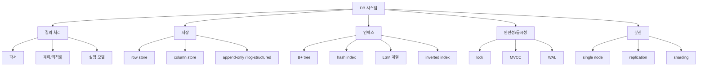
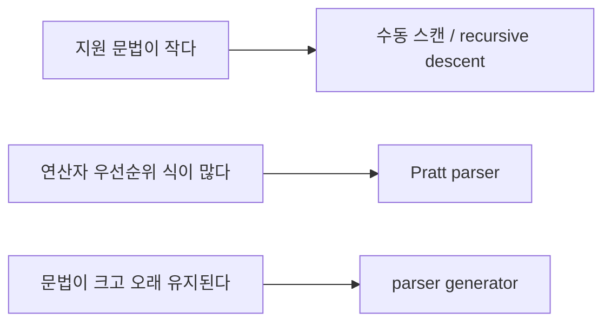
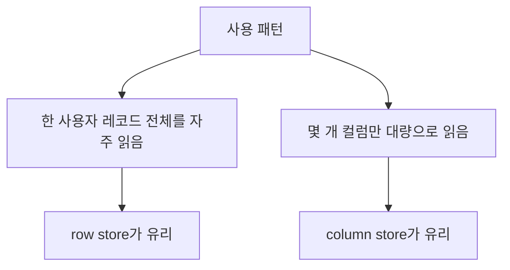
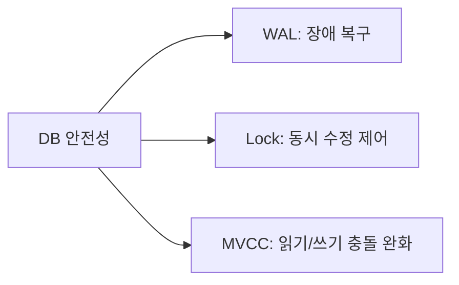
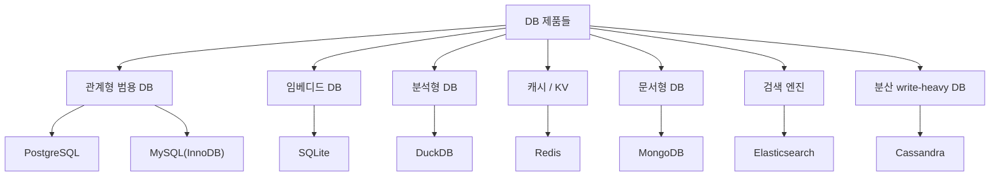
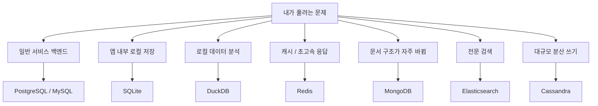
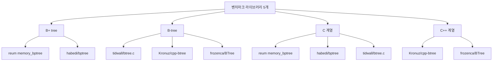
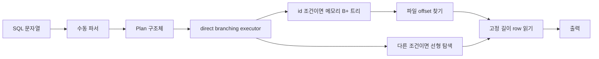

# reum-014 DB 기술과 제품 비교 지도

## 이 문서는 왜 필요한가

발표를 듣다 보면 이런 말들이 한꺼번에 나온다.

- B+ 트리
- LSM 트리
- WAL
- MVCC
- row store
- column store
- iterator model
- vectorized execution
- PostgreSQL
- Redis
- Elasticsearch

그런데 이 단어들은 전부 같은 층의 개념이 아니다.

- 어떤 것은 **인덱스 기술**
- 어떤 것은 **저장 방식**
- 어떤 것은 **실행 방식**
- 어떤 것은 **트랜잭션/복구 기술**
- 어떤 것은 **DB 제품 이름**

이다.

그래서 이 문서는

> "서로 비교해야 하는 것끼리 묶어서 보고,  
> 각 기술과 제품이 왜 존재하는지 이해하는 것"

을 목표로 한다.

특히 아래 상황에서 읽으면 좋다.

- 다른 팀 발표에서 모르는 기술 이름이 자꾸 나올 때
- DB 제품 이름은 아는데 왜 쓰는지 설명이 안 될 때
- "우리 SQL 처리기는 어떤 스타일인가?"를 한 문장으로 정리하고 싶을 때

---

## 0. 먼저 큰 그림: DB를 구성하는 기술들은 층이 다르다

### 그림 1. DB 기술을 층으로 나누어 보기

### 핵심 포인트

누군가 "우리는 B+ 트리를 썼어요"라고 말하면
그건 **인덱스 층** 이야기다.

누군가 "우리는 MVCC를 썼어요"라고 말하면
그건 **동시성 제어 층** 이야기다.

누군가 "우리는 PostgreSQL 기반입니다"라고 말하면
그건 여러 기술이 합쳐진 **제품 전체** 이야기다.

즉, 발표를 들을 때는 먼저

> "지금 이 사람이 말하는 것은 기술 층인가, 제품인가?"

를 구분하면 훨씬 덜 헷갈린다.

---

## 1. 같이 비교해야 이해가 쉬운 기술 묶음

### 1-1. SQL 파서를 만드는 방식끼리 비교

### 표 1. SQL 파서 스타일 비교

| 방식 | 쉬운 설명 | 장점 | 단점 | 주로 쓰이는 곳 |
| --- | --- | --- | --- | --- |
| 문자열 분리/수동 스캔 | 공백, 괄호, 쉼표를 코드로 직접 읽음 | 빠르게 만들 수 있음, 디버깅 쉬움 | 문법이 커지면 코드가 금방 복잡해짐 | 과제, 프로토타입, 교육용 엔진 |
| recursive descent parser | 문법 규칙별로 함수를 나눠 재귀적으로 파싱 | 코드 구조가 비교적 읽기 쉬움 | 문법이 커지면 함수 수가 늘어남 | 작은 언어 처리기, 수제 컴파일러 |
| parser generator | Bison/Yacc 같은 도구가 파서를 생성 | 복잡한 문법을 체계적으로 다루기 좋음 | 입문자에게는 추상적이고 설정이 무거움 | 본격 SQL 엔진, 컴파일러 |
| Pratt parser | 연산자 우선순위가 있는 식에 강함 | 수식 파싱에 강함 | SQL 전체보다는 expression 부분에 더 적합 | 수식 평가기, 일부 쿼리 언어 구현 |

### 그림 2. 파서 방식 선택 감각

### 초보자용 한 줄 정리

- 문법이 작고 과제 규모가 작으면 수동 파서도 충분하다
- 문법이 커질수록 "코드로 직접 다루는 방식"은 점점 힘들어진다

---

### 1-2. 쿼리를 실행하는 방식끼리 비교

### 표 2. 실행기 스타일 비교

| 방식 | 쉬운 설명 | 장점 | 단점 | 주로 쓰이는 곳 |
| --- | --- | --- | --- | --- |
| direct branching executor | `if`, `switch`로 바로 분기해서 실행 | 구현이 단순하고 흐름이 눈에 잘 보임 | 쿼리 종류가 많아지면 분기문이 커짐 | 교육용 DB, 작은 SQL 처리기 |
| iterator / volcano model | 각 연산자가 `next()` 식으로 한 줄씩 결과를 줌 | 연산자 조합이 쉬움, 구조가 모듈화됨 | 함수 호출이 많아질 수 있음 | 전통적인 관계형 DB |
| vectorized execution | 여러 줄을 한 번에 묶어서 처리 | 분석 쿼리에 강함, CPU 효율이 좋음 | 구현 난도가 높음 | 분석형 DB, 컬럼형 엔진 |
| compiled query / JIT | 쿼리를 실행용 코드로 더 직접 바꿈 | 특정 워크로드에서 매우 빠를 수 있음 | 구현 복잡도 높음 | 고성능 상용/연구용 엔진 |

### 표 3. direct branching과 iterator를 특히 많이 비교하는 이유

| 질문 | direct branching | iterator |
| --- | --- | --- |
| 초보자가 흐름을 따라가기 쉬운가 | 매우 쉬움 | 처음엔 조금 낯설 수 있음 |
| 기능 추가 시 구조화가 쉬운가 | 점점 어려워질 수 있음 | 비교적 쉬움 |
| 작은 과제에 적합한가 | 매우 적합 | 가능하지만 다소 과할 수 있음 |
| 큰 DBMS에 적합한가 | 한계가 빨리 옴 | 더 확장성이 좋음 |

---

### 1-3. 데이터를 저장하는 방식끼리 비교

### 표 4. 저장 방식 비교

| 방식 | 쉬운 설명 | 장점 | 단점 | 주로 쓰이는 곳 |
| --- | --- | --- | --- | --- |
| row store | 한 행의 값들을 붙여서 저장 | 한 행 전체를 읽거나 수정하기 좋음 | 일부 컬럼만 읽는 분석 작업엔 비효율적일 수 있음 | OLTP, 일반 업무 DB |
| column store | 같은 컬럼 값끼리 모아 저장 | 필요한 컬럼만 읽기 좋아 분석에 강함 | 한 행 전체 수정에는 불리할 수 있음 | OLAP, 분석형 DB |
| append-only / log-structured | 뒤에 계속 붙이며 기록, 나중에 정리 | 쓰기에 강함, 로그/이력 관리와 잘 맞음 | 정리(compaction) 비용이 따름 | 로그 시스템, LSM 계열 저장 엔진 |

### 그림 3. row store와 column store 감각

### 초보자용 기억법

- "사용자 한 명 정보 보기" 같은 작업이 많으면 `row store`
- "1년치 매출 합계 계산" 같은 작업이 많으면 `column store`

---

### 1-4. 인덱스 기술끼리 비교

### 표 5. 대표 인덱스/검색 구조 비교

| 기술 | 잘하는 일 | 장점 | 단점 | 주로 쓰이는 곳 |
| --- | --- | --- | --- | --- |
| B-트리 / B+ 트리 | 범위 검색, 정렬, 점 조회 | 범용성이 높고 DB에서 표준처럼 널리 쓰임 | hash보다 특정 점 조회만 놓고 보면 덜 단순할 수 있음 | 관계형 DB 기본 인덱스 |
| hash index | 정확히 같은 키 찾기 | 단순하고 빠른 동등 비교 | 범위 검색, 정렬에는 약함 | 메모리 KV, 특수 보조 인덱스 |
| LSM tree | 쓰기 많은 환경 | 대량 쓰기에 강함 | 읽기 경로와 compaction이 복잡해짐 | write-heavy 분산 DB |
| inverted index | 단어 검색 | 전문 검색에 강함 | 일반 행/컬럼 조회 구조와는 목적이 다름 | 검색 엔진 |

### 표 6. 자주 묻는 비교: B+ 트리 vs hash index

| 질문 | B+ 트리 | hash index |
| --- | --- | --- |
| `=` 검색 | 좋음 | 매우 좋음 |
| `<`, `>`, `between` | 매우 좋음 | 거의 부적합 |
| 정렬 결과 얻기 | 좋음 | 부적합 |
| 범용 인덱스로 쓰기 | 좋음 | 제약이 큼 |

### 표 7. 자주 묻는 비교: B+ 트리 vs LSM 계열

| 질문 | B+ 트리 | LSM 계열 |
| --- | --- | --- |
| 읽기 단순성 | 비교적 단순 | 여러 레벨/파일을 볼 수 있어 더 복잡 |
| 쓰기 성능 | 균형형 | 쓰기 중심에서 강함 |
| compaction 필요성 | 상대적으로 덜 중심적 | 매우 중요 |
| 대표 사용처 | 전통적인 관계형 DB | Cassandra, RocksDB 계열 |

---

### 1-5. 안전성과 동시성을 위한 기술끼리 비교

### 표 8. WAL, lock, MVCC 비교

| 기술 | 질문 | 쉬운 뜻 | 장점 | 단점/비용 |
| --- | --- | --- | --- | --- |
| WAL | "장애가 나면 어떻게 복구하지?" | 바뀐 내용을 로그에 먼저 적음 | 복구에 강함 | 로그 관리 비용 |
| lock | "여러 사용자가 동시에 바꿀 때 충돌을 어떻게 막지?" | 먼저 쓰는 사람이 잠금 | 단순하고 직관적 | 경합이 심하면 대기 많아짐 |
| MVCC | "읽는 사람과 쓰는 사람이 덜 부딪히게 할 수 없나?" | 여러 버전을 두고 읽기/쓰기를 분리 | 읽기 동시성에 강함 | 버전 관리가 복잡 |

### 그림 4. 이 셋은 경쟁 관계라기보다 역할이 다르다

### 중요 포인트

이 셋은 "하나만 고르는 메뉴"가 아니다.
실제 제품에서는 같이 쓰이는 경우가 많다.

예:

- PostgreSQL: WAL + MVCC
- MySQL InnoDB: redo/undo log + lock + MVCC
- SQLite: journal/WAL + 단순한 잠금 모델

---

## 2. 자주 같이 묶어 생각하는 DB 제품들 비교

## 먼저 알아둘 점

아래 제품들은 전부 "DB"이긴 하지만
서로 같은 문제를 풀기 위해 태어난 것은 아니다.

즉,

> PostgreSQL과 Redis는 둘 다 유명하지만  
> 같은 문제를 가장 잘 푸는 제품은 아니다.

비교는 가능하지만
**용도가 다르다**는 사실을 항상 같이 봐야 한다.

### 그림 5. 제품을 목적별로 묶어 보기

---

### 2-1. 관계형/범용 DB 제품 비교

### 표 9. PostgreSQL, MySQL, SQLite, DuckDB 비교

| 제품 | 핵심 특징 | 장점 | 단점 | 주 사용처 | 대표 기술 | 왜 그 기술을 쓰나 |
| --- | --- | --- | --- | --- | --- | --- |
| PostgreSQL | 범용성이 매우 높은 관계형 DB | 기능이 풍부하고 확장성이 좋음 | 운영 난도가 SQLite보다 높음 | 서비스 백엔드, 복잡한 SQL, 확장형 시스템 | MVCC, WAL, B-tree, GIN/GiST/BRIN, cost-based optimizer | 다양한 쿼리와 안정성을 동시에 잡기 위해 |
| MySQL(InnoDB) | 웹 서비스에서 많이 쓰이는 관계형 DB | 실무 사례가 많고 운영 자료가 많음 | PostgreSQL보다 일부 고급 기능은 덜 유연하게 느껴질 수 있음 | 웹 서비스, 일반 OLTP | clustered primary key B+ tree, secondary index, buffer pool, redo/undo log, MVCC | 트랜잭션과 일반 웹 트래픽 처리에 균형을 맞추기 위해 |
| SQLite | 파일 하나로 동작하는 임베디드 DB | 설정이 거의 없고 배포가 쉬움 | 대규모 동시 쓰기에는 부적합 | 모바일 앱, 데스크톱 앱, 로컬 저장 | B-tree page, journal/WAL, embedded architecture | 설치형 서버 없이 로컬 파일 DB를 쉽게 쓰기 위해 |
| DuckDB | 로컬 분석에 강한 분석형 DB | CSV/Parquet 분석이 매우 편함 | 일반 OLTP용 주력 DB로 쓰기엔 방향이 다름 | 데이터 분석, 실험, 로컬 OLAP | columnar storage, vectorized execution, compression | 대량 분석 쿼리를 CPU 친화적으로 빠르게 돌리기 위해 |

### 초보자용 감각

- PostgreSQL: "기능 많은 범용 관계형 DB"
- MySQL: "웹 서비스에서 많이 쓰는 범용 관계형 DB"
- SQLite: "앱 안에 들어가는 파일형 관계형 DB"
- DuckDB: "로컬 분석용 초경량 분석 DB"

---

### 2-2. 비관계형/특수 목적 DB 제품 비교

### 표 10. Redis, MongoDB, Elasticsearch, Cassandra 비교

| 제품 | 핵심 특징 | 장점 | 단점 | 주 사용처 | 대표 기술 | 왜 그 기술을 쓰나 |
| --- | --- | --- | --- | --- | --- | --- |
| Redis | 메모리 기반 KV / 자료구조 서버 | 매우 빠르고 단순함 | 메모리 중심이라 큰 영속 저장소로는 비용이 큼 | 캐시, 세션, 큐, 랭킹 | hash table, skiplist, in-memory data structure, AOF/RDB | 초저지연 응답과 단순한 자료구조 조작을 위해 |
| MongoDB | JSON 비슷한 문서형 DB | 스키마 유연성이 큼 | 관계형 join/정교한 제약은 상대적으로 덜 자연스러움 | 문서 중심 서비스, 빠른 스키마 변화 | BSON document, B-tree index, replication, sharding | 구조가 자주 바뀌는 문서를 유연하게 다루기 위해 |
| Elasticsearch | 검색과 로그 분석에 강한 엔진 | 전문 검색, 로그 탐색에 강함 | 일반 트랜잭션 DB처럼 쓰기엔 부적합 | 검색, 로그, 관측성 | inverted index, segment merge, distributed shards | 단어 검색과 대규모 검색/집계를 빠르게 하기 위해 |
| Cassandra | 분산 write-heavy DB | 확장성과 쓰기 처리에 강함 | 데이터 모델과 일관성 이해가 어렵다 | 대규모 분산 서비스, write-heavy 시스템 | LSM tree, SSTable, partitioning, tunable consistency | 많은 노드에 데이터를 분산하고 쓰기량을 크게 처리하기 위해 |

### 표 11. 제품을 고를 때 자주 하는 질문

| 질문 | 잘 맞는 예시 |
| --- | --- |
| "검색창에 단어 검색이 핵심인가?" | Elasticsearch |
| "캐시나 세션 저장이 핵심인가?" | Redis |
| "문서 구조가 자주 바뀌나?" | MongoDB |
| "엄청 많은 노드로 write-heavy 분산 처리가 필요한가?" | Cassandra |

---

## 3. 기술 조합으로 보면 제품 성격이 더 잘 보인다

### 표 12. 제품별 기술 조합을 짧게 요약하면

| 제품 | 저장 방식 | 인덱스/검색 | 실행 스타일 | 안전성/동시성 | 한 줄 성격 |
| --- | --- | --- | --- | --- | --- |
| PostgreSQL | row store | B-tree + 다양한 보조 인덱스 | 전통적 iterator 계열 + optimizer | WAL + MVCC | 범용 관계형 강자 |
| MySQL(InnoDB) | row store | clustered B+ tree + secondary index | 전통적 executor | redo/undo + MVCC | 실무형 웹 OLTP 강자 |
| SQLite | row store file | B-tree | 단일 파일형 간결 executor | journal/WAL + 단순 잠금 | 임베디드 로컬 DB |
| DuckDB | column store | 분석 보조 구조 | vectorized execution | 단일 프로세스 분석 중심 | 로컬 분석 특화 |
| Redis | in-memory structure | hash/skiplist | 명령 단위 실행 | 단순 복제/지속성 옵션 | 초저지연 캐시/KV |
| MongoDB | document store | B-tree 계열 | 문서 쿼리 executor | replication + transaction support | 유연한 문서 DB |
| Elasticsearch | segment store | inverted index | 검색/집계 파이프라인 | distributed replication | 검색/로그 특화 |
| Cassandra | LSM 계열 | SSTable + Bloom filter 보조 | 분산 read/write 경로 | replication + tunable consistency | 분산 write-heavy 특화 |

### 그림 6. 목적별로 제품 선택 감각 잡기

---

## 4. 이번 벤치마크에 쓴 B-tree/B+tree 라이브러리들은 어떤 성격인가

## 먼저 알아둘 점

이번 벤치마크에 넣은 다섯 라이브러리는 모두

- 메모리 기반
- ordered key-value 탐색 구조
- `insert` / `get` 비교가 가능한 구현

이라는 공통점이 있다.

하지만 세부적으로는 다르다.

- B-tree냐, B+ tree냐
- C냐, C++냐
- single file이냐, header-only냐
- 교육용에 가까우냐, 실전용 라이브러리 느낌이 강하냐

가 서로 다르다.

그래서 아래 비교는

> "누가 절대적으로 최고인가"

보다는

> "각 라이브러리가 어떤 성격의 구현인가"

를 이해하는 데 초점을 둔다.

### 그림 7. 다섯 라이브러리를 두 축으로 나누면

### 벤치마크 라이브러리 요약표

| 라이브러리 | 계열 | 언어/형태 | 핵심 느낌 | 강점 | 주의할 점 |
| --- | --- | --- | --- | --- | --- |
| `reum memory_bptree` | B+ tree | 프로젝트 내부 C 구현 | 과제 맞춤 기준선 | 구조 설명이 쉽고 프로젝트 흐름과 직접 연결됨 | 범용 라이브러리라기보다 과제 요구사항에 맞춘 단순 구현 |
| `habedi/bptree` | B+ tree | single-header C | C에서 쓰기 좋은 정돈된 B+ tree | B+ tree 스타일 비교군으로 의미가 큼, lookup이 꾸준함 | C 단일 헤더 스타일이라 확장/추상화는 제한적일 수 있음 |
| `tidwall/btree.c` | B-tree | 단일 C 파일 | 임베드하기 쉬운 C B-tree | 의존성이 적고 붙이기 쉽다 | 이번 실험에선 최상위권 빈도는 낮았음 |
| `Kronuz/cpp-btree` | B-tree | header-only C++ | 성숙한 C++ B-tree | 전체적으로 가장 많은 우승 횟수, dense key에서 강함 | C++ 템플릿 기반이라 C 프로젝트에 바로 붙이긴 어렵다 |
| `frozenca/BTree` | B-tree | header-only C++ | 현대 C++ 스타일 B-tree | hot-spot/랜덤 계열에서 인상적인 구간이 있음 | 템플릿/현대 C++ 스타일이 입문자에겐 다소 무겁다 |

### 왜 이 다섯 개를 같이 비교했나

이 다섯 개를 묶으면 아래 대비가 한 번에 잡힌다.

- 내부 구현 vs 외부 라이브러리
- B+ tree vs B-tree
- C 구현 vs C++ 구현
- 교육용 기준선 vs 상대적으로 성숙한 라이브러리

즉, 단순히 "빠른 것 찾기"보다

> "같은 트리 계열이라도 구현 언어와 설계 감각이 다르면 성격이 달라진다"

를 보기 좋은 조합이다.

### 4-1. `reum memory_bptree`

이 구현은 우리 프로젝트 안에 있는 메모리 기반 B+ 트리다.

핵심 특징은 이렇다.

- `int key -> long value` 형태의 단순한 인터페이스
- 과제에서 필요한 `id -> 위치` 연결에 바로 맞는 구조
- 설명과 디버깅이 쉬운 교육용 기준선 역할

특히 이 구현은

> "프로젝트와 가장 잘 연결되는 구현"

이라는 점이 중요하다.

왜냐하면 성능만 보는 라이브러리가 아니라,
실제로 `db_index.c`와 붙어 `WHERE id = ?` 경로를 만드는 엔진이기 때문이다.

이번 실험에서는

- 작은 dense dataset에서 매우 강한 lookup을 보여줬고
- hot-spot get에서도 꽤 좋은 편이었고
- 반대로 sparse random 시나리오에서는 순위가 흔들렸다

즉,

> "우리 과제에 잘 맞는 기준선이지만, 데이터 분포가 바뀌면 민감하게 흔들릴 수 있다"

는 성격으로 읽으면 좋다.

### 4-2. `habedi/bptree`

이 구현은 C로 된 single-header B+ tree 라이브러리다.

핵심 특징은 이렇다.

- C 프로젝트에 넣기 쉬운 형태
- B+ tree 계열 비교군으로 의미가 큼
- 점 조회와 ordered map 느낌을 비교적 깔끔하게 제공

이번 실험에서는

- lookup 성능이 아주 화려하게 튀기보다는
- 여러 시나리오에서 꾸준하게 중상위권을 유지하는 편이었다

특히 문서와 HTML 결과를 보면,

> B+ tree 계열 중에서는 가장 "꾸준한 lookup" 이미지

로 읽히는 구간이 많았다.

초보자 입장에서는

- "B+ tree 스타일 외부 라이브러리는 이런 느낌이구나"
- "C 기반으로도 ordered tree 라이브러리를 꽤 단정하게 만들 수 있구나"

를 보기 좋은 예시다.

### 4-3. `tidwall/btree.c`

이 구현은 단일 C 파일 기반의 B-tree 라이브러리다.

핵심 특징은 이렇다.

- 파일 수가 적고 임베드하기 쉽다
- C만으로 바로 붙이기 편하다
- "작고 독립적인 B-tree 부품" 같은 느낌이 강하다

이런 스타일의 장점은

> 실험용, 임베디드용, 작은 프로젝트에서 가져다 붙이기 쉽다

는 점이다.

하지만 이번 벤치마크에서는

- 항상 느린 것은 아니었지만
- 전체 우승 횟수 기준으로는 상위권 빈도가 높지 않았다

그래서 이 라이브러리는

> "아주 강한 1등 후보"라기보다  
> "가볍고 붙이기 쉬운 C B-tree 구현"

이라는 관점에서 이해하는 편이 좋다.

### 4-4. `Kronuz/cpp-btree`

이 구현은 header-only C++ B-tree 계열 라이브러리다.

핵심 특징은 이렇다.

- 상대적으로 성숙한 C++ 구현 느낌이 강하다
- dense key 시나리오에서 특히 강한 면이 보였다
- 전체 lookup/insert 우승 횟수가 가장 많았다

이번 실험에서는 사실상

> "전체 통합 성적이 가장 좋은 라이브러리"

에 가까웠다.

특히 문서 기준으로 보면

- lookup 우승 횟수 1위
- insert 우승 횟수 1위
- dense key와 큰 데이터셋 구간에서 강세

가 눈에 띈다.

초보자 입장에서는 이 라이브러리를

> "성능 중심 비교에서 가장 강하게 보인 C++ B-tree"

정도로 기억하면 좋다.

다만 C++ 템플릿 계열이라
C 위주 프로젝트에 바로 녹이기엔 빌드와 연동 부담이 더 있을 수 있다.

### 4-5. `frozenca/BTree`

이 구현은 현대 C++ 스타일의 header-only B-tree 라이브러리다.

핵심 특징은 이렇다.

- 최신 C++ 스타일 느낌이 강하다
- hot-spot get, 일부 랜덤 시나리오에서 인상적인 구간이 있다
- 어떤 시나리오에서는 Kronuz와 아주 가깝게 경쟁했다

이번 실험에서는

- 전체 승수 1위는 아니었지만
- 특정 시나리오에서 강하게 튀는 장면이 있었고
- 랜덤/지역성 있는 접근에서 매력적인 결과를 보였다

그래서 이 라이브러리는

> "항상 무난한 중간"보다  
> "특정 상황에서 꽤 세게 치고 올라오는 타입"

으로 이해하면 좋다.

초보자에게는

- C와 C++ 구현의 스타일 차이
- 같은 B-tree라도 코드 문화가 얼마나 달라지는지

를 느끼게 해주는 비교군이기도 하다.

### 벤치마크 관점에서 다섯 개를 한 줄씩 요약하면

| 라이브러리 | 한 줄 요약 |
| --- | --- |
| `reum memory_bptree` | 프로젝트와 가장 잘 연결되는 기준선 B+ tree |
| `habedi/bptree` | C 기반에서 꾸준한 lookup을 보여준 단정한 B+ tree |
| `tidwall/btree.c` | 가볍고 붙이기 쉬운 단일 C 파일 B-tree |
| `Kronuz/cpp-btree` | 전체 성적이 가장 강했던 C++ B-tree |
| `frozenca/BTree` | 특정 시나리오에서 인상적인 고점이 있는 현대 C++ B-tree |

### 이 섹션을 읽을 때 주의할 점

이번 결과는

- 특정 데이터셋
- 특정 key 분포
- 특정 adapter 규칙
- 특정 컴파일 환경

위에서 나온 것이다.

그래서

> "이 라이브러리가 언제나 절대 1등이다"

라고 읽으면 안 되고,

> "이번 실험 조건에서 이런 성향이 드러났다"

로 읽는 것이 맞다.

---

## 5. 우리 미니 DB SQL 처리기는 어떤 스타일인가

## 한 문장으로 먼저 말하면

우리 SQL 처리기는

> "수동 파서 + 얕은 Plan 구조체 + direct branching executor + 고정 길이 row 파일 + 시작 시 재구축되는 메모리 B+ 트리"

스타일이다.

즉, 대형 상용 DB처럼 모든 층이 있는 것은 아니고,
과제 요구사항을 만족하기 위해 가장 이해하기 쉬운 구조를 고른
**교육용 단일 노드 미니 SQL 처리기**라고 보면 된다.

### 그림 7. 우리 SQL 처리기 흐름

### 표 13. 우리 처리기를 층별로 분류하면

| 층 | 우리 프로젝트의 선택 | 왜 이렇게 했나 | 장점 | 한계 |
| --- | --- | --- | --- | --- |
| 파서 | 수동 문자열 스캔 방식 | 하루 프로젝트에서 구현과 설명이 쉬움 | 코드 흐름이 눈에 잘 보임 | 문법 확장성이 작음 |
| 내부 표현 | `Plan` 구조체 하나 | AST/optimizer까지 가기엔 과제 범위를 넘음 | 구현이 단순함 | 복잡한 쿼리에 부적합 |
| 실행기 | `if` 분기 기반 direct executor | `SELECT`, `INSERT` 두 경로를 명확히 나누기 쉬움 | 초보자가 추적하기 쉬움 | 기능이 늘수록 분기가 커짐 |
| 저장 | 고정 길이 row 파일 | offset 계산과 데모가 쉬움 | 단순하고 디버깅 쉬움 | 공간 비효율과 유연성 한계 |
| 인덱스 | 시작 시 재구축하는 메모리 B+ 트리 | 과제 요구사항인 메모리 기반 구현에 맞춤 | id 조회가 빠르고 구조 설명이 쉬움 | 재시작 시 재구축 비용이 듦 |
| 비-id 조회 | 선형 탐색 | 인덱스 사용 vs 미사용 비교가 명확함 | 과제 의도 설명이 쉬움 | 큰 데이터에서 느림 |
| 트랜잭션/복구 | 거의 없음 | 과제 핵심 범위가 아님 | 구현량을 줄임 | 실서비스 DB 기능과 차이가 큼 |

### 표 14. 코드 파일 기준으로 보면

| 파일 | 역할 | 이 문서에서의 분류 |
| --- | --- | --- |
| `parser.c` | SQL 문자열을 읽어 `Plan` 생성 | 수동 파서 |
| `executor.c` | `Plan`을 보고 SELECT/INSERT 실행 | direct branching executor |
| `db_index.c` | 시작 시 인덱스 재구축, id 조회/삽입 | 메모리 B+ 트리 인덱스 계층 |
| `memory_bptree.c` | 실제 메모리 기반 B+ 트리 | 인덱스 엔진 |
| `mini_db.h` | 공통 자료구조와 계약 | 얕은 IR/Plan 정의 |

### 표 15. 다른 유명 스타일과 비교하면

| 비교 대상 | 우리 프로젝트 | 대형 관계형 DB |
| --- | --- | --- |
| 파서 | 수동 스캔 | 더 정교한 parser/grammar |
| 계획 | 단순한 `Plan` 구조체 | AST + logical plan + physical plan + optimizer |
| 실행 | 직접 분기 | operator 조합, iterator, vectorized 등 |
| 저장 | 단순 파일 row | page, buffer manager, slotted page |
| 인덱스 | 메모리 B+ 트리 하나 중심 | 여러 인덱스 타입 공존 |
| 동시성/복구 | 거의 없음 | MVCC, WAL, lock manager 등 |

### 왜 이 스타일이 과제에는 잘 맞는가

이 과제의 핵심은

- SQL 처리기를 완전히 새로 만들기
- B+ 트리로 id 조회를 빠르게 만들기
- 선형 탐색과 성능 차이를 보여주기

였다.

그래서 우리 구조는

> "복잡한 범용 DB를 흉내 내기"보다  
> "인덱스가 성능 차이를 만든다는 사실을 가장 명확하게 보여주기"

에 맞춰져 있다.

즉, 교육용 과제로는 매우 좋은 선택이고,
상용 DB와 완전히 같지 않다는 점도 오히려 설명 포인트가 된다.

---

## 6. 발표에서 들은 말을 어디에 꽂아야 하는지 빠르게 찾는 표

### 표 16. 발표 용어 빠른 분류표

| 발표에서 들은 말 | 어느 묶음인가 | 바로 떠올리면 좋은 비교 상대 |
| --- | --- | --- |
| parser, token, AST | 파서/언어 처리 | 수동 파서, recursive descent, generator |
| iterator, volcano, vectorized | 실행기 | direct branching, iterator, vectorized |
| row store, column store | 저장 방식 | 행 저장 vs 열 저장 |
| B+ tree, hash, LSM | 인덱스/저장 엔진 | 범용 조회 vs write-heavy vs equality |
| WAL, MVCC, lock | 안전성/동시성 | 복구 vs 동시성 제어 |
| PostgreSQL, MySQL, SQLite | 관계형 제품 | 범용/웹 OLTP/임베디드 |
| Redis, MongoDB, Elasticsearch | 특수 목적 제품 | 캐시/KV, 문서, 검색 |

---

## 7. 이 문서를 읽고 나면 무엇이 가능해야 하나

이 문서를 읽고 나면 최소한 아래 정도는 말할 수 있으면 좋다.

1. B+ 트리와 hash index는 같은 "인덱스 비교" 범주다
2. row store와 column store는 같은 "저장 방식 비교" 범주다
3. PostgreSQL과 Redis는 둘 다 DB지만 같은 용도의 제품은 아니다
4. 벤치마크에 쓴 다섯 라이브러리의 성격을 대략 구분해 설명할 수 있다
5. 우리 SQL 처리기는 수동 파서와 direct executor를 쓰는 교육용 미니 엔진 스타일이다
6. 제품 이름이 나오면 "이 제품은 어떤 기술 조합으로 이런 성격을 갖게 되었는가"를 생각할 수 있다

---

## 8. 추천 다음 문서

이 문서를 읽은 뒤에는 목적에 따라 다음으로 가면 좋다.

| 목적 | 다음 문서 |
| --- | --- |
| 발표 용어를 더 많이 알고 싶다 | `reum-013` |
| 트리 파라미터가 왜 성능에 영향을 주는지 알고 싶다 | `reum-012` |
| 우리 프로젝트 코드 흐름과 연결하고 싶다 | `reum-007` |
| 설계 선택지를 더 보고 싶다 | `reum-005` |

---

## 마지막 한 줄

> DB를 이해하는 가장 쉬운 방법은  
> "기술", "제품", "우리 프로젝트"를 섞지 말고  
> 같은 종류끼리 나눠 비교하는 것이다.
